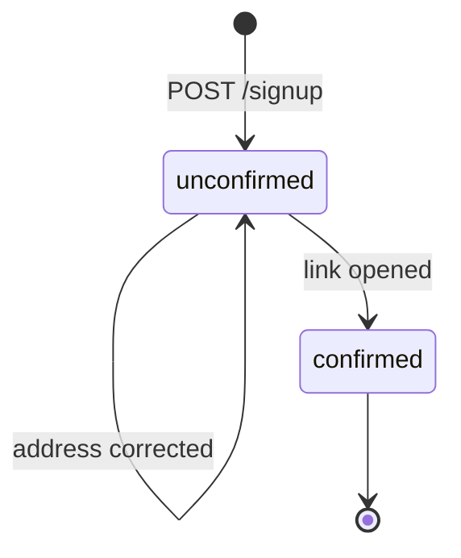
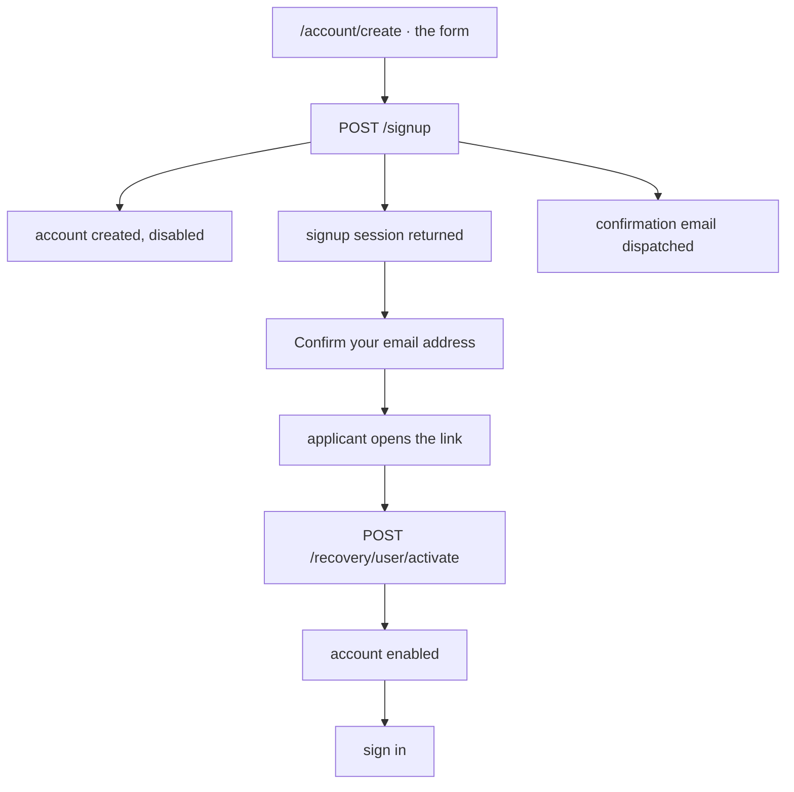
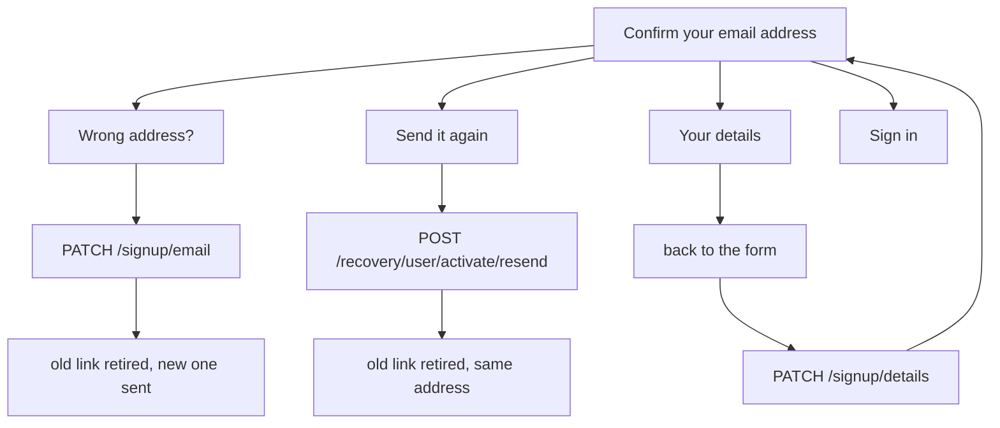

# Account Creation

Somebody who wants an account fills in one form and gets an account that works
once they open a link sent to the address they typed. That account is a guest
account: it lets a person sign in, sign up for events and appear in the system.
It says nothing about membership, which is a separate decision made later and
often never.

Everything typed on the way in stays correctable until the address is confirmed,
because until that moment nobody has been able to use the account.

This is the base flow. [Membership signup](../membership-signup/README.md) is this
flow plus a member profile, an address and an application — it reuses the account
half described here rather than restating it.

## Scope

Covers public self-service account creation at `/account/create`, the
confirmation that makes the account usable, and the corrections available while
it is still unconfirmed.

Does **not** cover:

- **[Membership signup](../membership-signup/README.md).** Joining the
  association. It builds on this flow — same first step, same confirmation step —
  and adds an address, an application, and the rendezvous that starts a
  membership. Everything specific to becoming a member lives there.
- **[Signing in](../sign-in/README.md).** What confirmation opens the door to.
- **Board-created accounts.** A board member creating an account on someone's
  behalf issues a `MEMBER_ACTIVATION` token and sends the recipient to
  `/account/activate/member` to choose a username and password. Different token
  purpose, different page, different email.
- **Password reset.** Shares the `recovery_tokens` table and nothing else.

## Actors and entry points

| Actor | Entry point | Outcome |
|-------|-------------|---------|
| Somebody with no account | `/account/create` | An account, unusable until confirmed |
| The same person, from their inbox | `/account/activate/user#token=…` | The address confirmed, the account usable |

Both are reachable without authentication. Board members create accounts for
other people through `POST /users`, a different endpoint under a different
permission.

## States

| State | `users.enabled` | Can sign in | Details editable by | Signup session |
|-------|-----------------|-------------|---------------------|----------------|
| Unconfirmed | `false` | no | the signup session | live |
| Confirmed | `true` | yes | a signed-in session | spent |

The unconfirmed state is a resting state, not a waiting room: an account can sit
there indefinitely. There is no automatic cleanup of accounts that never confirm.

## Invariants

1. **An unconfirmed account cannot sign in.** `UserAuthenticationProvider` throws
   `DisabledException` for `enabled = false`, so being signed in anywhere in the
   system means the address behind the account was proven reachable.
2. **Creating an account never makes anybody a member.** No membership, no
   `Role.MEMBER`, no appearance in the member list.
3. **One confirmation link is live at a time.** Asking for the email again, or
   correcting the address, retires whatever was outstanding before sending the
   next one.
4. **A link sent to a mistyped address stops working when the address is
   corrected.** That address may be somebody else's inbox.
5. **The signup session cannot change a confirmed account.** Once `enabled` is
   true, details and address change under a session instead.
6. **The signup session cannot read the account back.** It writes and
   acknowledges; nothing more.

## The journey

1. **The form.** `POST /signup` creates the user disabled, returns a
   `SIGNUP_CONTINUATION` session in the response body, and sends a
   `USER_ACTIVATION` token by email.
2. **Confirm your email address.** Names the address the email went to and offers
   three things: correct the address, send the email again, or go back into the
   form and change any other detail.
3. **The link.** Opening it enables the account. Signing in is then possible.

## What the confirmation step offers

Correcting the address and resending both leave exactly one live link. Going back
into the form is an edit, not a re-registration: the account keeps its id, and
saving returns to the confirmation step.

## Credentials

| | Signup continuation | User activation |
|---|---|---|
| Purpose | Carry corrections before the address is confirmed | Prove the applicant controls the address |
| `TokenPurpose` | `SIGNUP_CONTINUATION` | `USER_ACTIVATION` |
| Sent out of band | Never — returned in the `POST /signup` response body | Yes, by email |
| Client holds it | In memory on the page, never placed in a URL | URL fragment, then `sessionStorage`, then discarded |
| TTL | 2 hours | 1 hour |
| Uses | Many, within the TTL | Exactly one |
| Authorises | Correct details · correct the address · save an address · submit an application | Enable the account |
| Retired by | Confirmation completing the signup, or expiry | Consumption, a newer link, or expiry |

Both are `selector.verifier` records in `recovery_tokens`: a 128-bit selector
identifies the row, a 256-bit verifier is stored BCrypt-hashed and compared on
presentation.

## Endpoints

| Method | Path | Authorisation | Notes |
|--------|------|---------------|-------|
| `POST` | `/signup` | `@PermitAll` | Body `CreateUserRequest`. Returns `SignupSessionResponse`. 10/min per client. |
| `PATCH` | `/signup/details` | `X-Signup-Token` | Everything the form collects except email and password. `204`. Refused once confirmed. 10/min. |
| `PATCH` | `/signup/email` | `X-Signup-Token` | Body `{ email }`. Retires the outstanding link and sends a new one. Refused once confirmed. 3/10min. |
| `POST` | `/recovery/user/activate/resend/{username}` | `@PermitAll` | Retires the outstanding link and resends to the address on file. 5/10min. |
| `POST` | `/recovery/user/activate` | `@PermitAll` | Body `{ token }`. Enables the account. Returns `{ membershipStarted }`. 10/10min. |

`X-Signup-Token` is listed in the CORS allowed headers in `SecurityConfig`. Apex
production is same-origin so no preflight happens there, but every dev and CI
stack splits the frontend and the api across ports.

### Why the paths say "signup"

The HTTP surface and the `SIGNUP_CONTINUATION` token purpose are named after
registration, not after membership. `POST /signup` is the one public way to create
an account of any kind — `POST /users` is board-only — and the routes hanging off
it carry the corrections available before an address is confirmed. Creating a
guest account and applying for membership both travel through them; neither owns
them. The name predates the split of these two flows into separate docs, and
renaming it would move an endpoint and migrate an enum value, so it stays.

## Failure and recovery

**Signup session expired.** Corrections are no longer possible; confirming the
address still is, because the confirmation link is independent of the session.
After confirming, everything is editable under a session.

**Tab closed, session lost.** Confirm from the inbox, sign in, and edit under a
session.

**Wrong address, noticed after confirming.** Changed through account settings.

**Link expired.** Ask for another from the confirmation step, or from the
password-reset path once signed in is impossible.

**Never confirmed.** The account stays unconfirmed and unusable. Nothing cleans
it up, and the username and email stay taken.

## Where the code lives

**API**

| Concern | Location |
|---------|----------|
| Signup endpoints | `domain/auth/web/SignupController.kt` |
| Details correction | `domain/user/application/command/UserCommandHandlers.kt` (`UpdateSignupDetailsHandler`) |
| Session issue, verify, retire | `domain/auth/application/SignupTokenService.kt` |
| Activation and resend | `domain/auth/application/UserActivationService.kt` |
| Token record and purposes | `domain/auth/persistence/RecoveryToken.kt`, `shared/enums/TokenPurpose.kt` |
| Rate limits | `infrastructure/security/PublicAuthRateLimitFilter.kt` |

**Frontend**

| Concern | Location |
|---------|----------|
| The page | `src/pages/login/CreateAccount.vue` |
| The confirmation step | `src/components/form/EmailConfirmationPanel.vue` |
| The form | `src/components/form/UserForm.vue` |
| Confirmation landing page | `src/pages/activate/ActivateUser.vue` |

The confirmation step is one component shared with membership signup, which is
why correcting an address behaves identically in both.

## Testing

| Suite | Location | Covers |
|-------|----------|--------|
| Acceptance features | [`account-creation.feature`](../../../services/system-tests/src/test/resources/features/account-creation.feature) | Confirmation gating, resending, correcting details, and that creating is not joining |
| Browser system tests | `services/system-tests/.../frontend/login/CreateAccountPageSystemTest.kt` | The page as a user drives it |
| Frontend unit | `services/frontend/tests/unit/pages/login/CreateAccount.test.ts` | The two states and the edit round trip |
| API integration | `services/api/src/integrationTest/.../auth/web/SignupDetailsIT.kt` | What the details route accepts and refuses |

## Related documentation

- [Membership signup](../membership-signup/README.md)
- [Signing in](../sign-in/README.md)
- [ADR-024: Scoped Signup Continuation Tokens](../../adr/api/ADR-024-scoped-signup-continuation-tokens.md)
