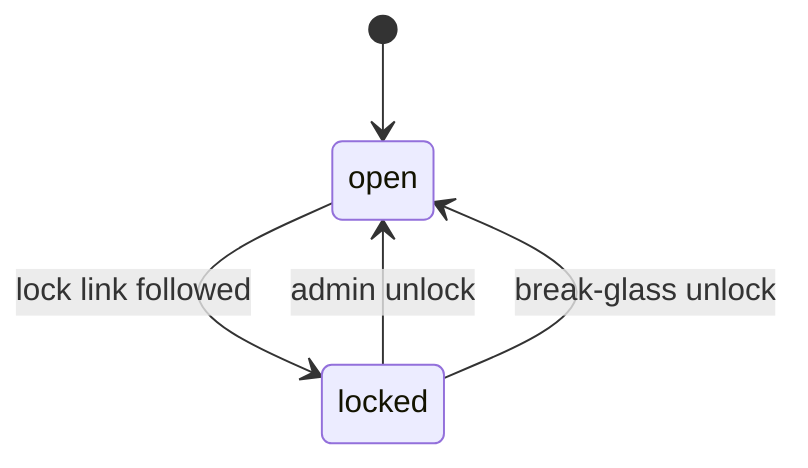
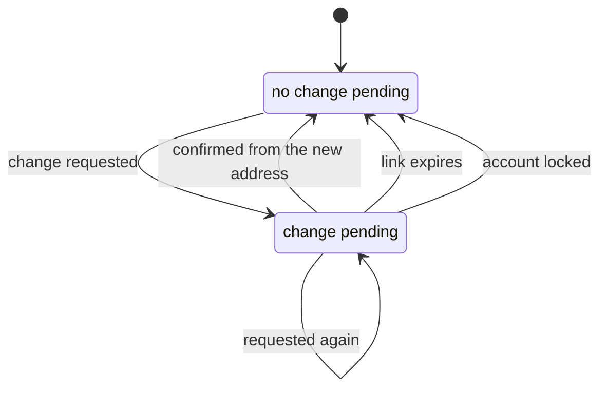
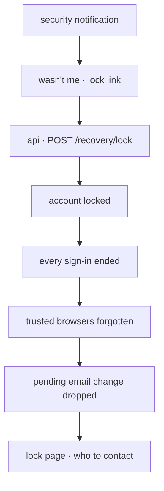
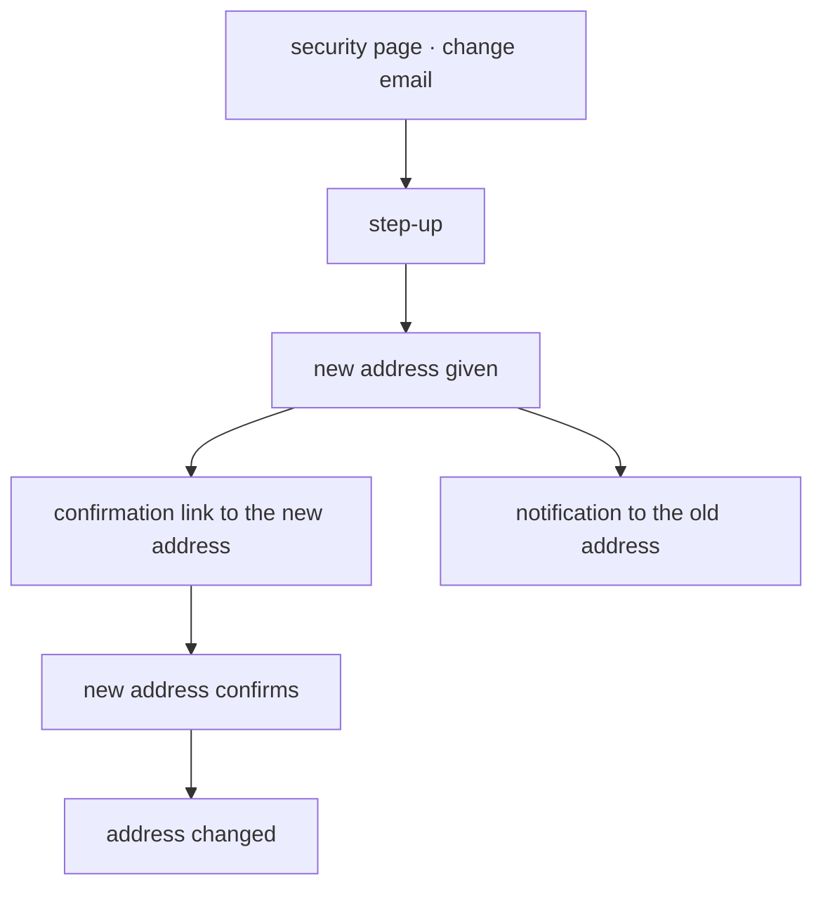

# Account lock

Every change to how somebody signs in is told to them in a security notification, and
every security notification carries a lock link: "wasn't me". Following it locks the
account. This doc covers what is told, how an account is locked and unlocked and the
email change that makes the old address the one that has to be told.

## 1. Scope

Covers security notifications, the lock link, the locked account, admin unlock, the
operator break-glass for an unlock and changing an email address — by the person
themselves or by the board.

Does not cover:

- **[Signing in](../sign-in/README.md).** Refusing a locked account at the gate.
- **[Two-factor](../two-factor/README.md).** The two-factor changes that send most of
  these notifications.
- **[Recovery emails](../recovery-emails/README.md).** Activation and password-reset
  emails. A security notification says something changed; a recovery email lets
  somebody in.

## 2. Actors and entry points

| Actor | Entry point |
|-------|-------------|
| Anybody receiving a security notification | the lock link in it |
| Anybody signed in | `/account/security` — change email address |
| The new address's owner | the confirmation link sent to it |
| Board member | the user manager's edit profile — change somebody's email address |
| Admin | `/user-manager` — unlock |
| Operator with cluster access | the break-glass command in the api image |

## 3. States

An open account can have an email change pending: requested and not yet confirmed from
the new address.

A lock is stored on the person, with when and through which notification it was made.
A lock link and an email confirmation link are rows in `recovery_tokens`, as
`ACCOUNT_LOCK` and `EMAIL_CHANGE`.

## 4. Invariants

- A change to how somebody signs in **cannot** happen without a security notification.
- A change of email address **cannot** go untold to the old address.
- A lock link **cannot** undo the change it was sent about. It only locks, because the
  inbox holding it may be the one that was taken, and handing the account back to that
  inbox would finish the takeover.
- A lock link **cannot** be used twice, nor after seventy-two hours.
- One lock link **cannot** retire another. An attacker who changes the address makes
  every later notification go to them; the owner's link on the old address has to
  survive that.
  This is the one exception to "one live link per kind" in `recovery_tokens`; see
  [api ADR-031](../../adr/api/ADR-031-two-factor-authentication.md).
- A locked account **cannot** be signed in to, and has no sign-in and no trusted browser
  left.
- A lock **cannot** leave an email change pending.
- An account **cannot** be unlocked by anybody but an admin, or an operator through
  break-glass.
- An admin **cannot** unlock without giving a reason.
- A lock or a break-glass run **cannot** go untold to the admins. Every admin is emailed.
- An email change **cannot** take effect until the new address confirms it.
- Somebody **cannot** change their own address, nor a board member somebody else's,
  without a step-up where the one changing it has two-factor on.

## 5. The journey

### Security notifications

| Change | Sent to |
|--------|---------|
| Email address changed | the old address, when the change is requested |
| Password changed or reset | the current address |
| Two-factor turned on, turned off or replaced | the current address |
| Backup codes regenerated | the current address |
| A backup code used | the current address |
| A browser trusted | the current address |
| Two-factor reset by an admin | the current address |
| Sign-in from a browser not seen before | the current address |
| A sign-in ended because an old cookie was reused or it moved browsers | the current address |
| Ten wrong codes in fifteen minutes | the current address |

Each names what changed, when, from which browser family and operating system, and
carries a lock link. Each ends with how to reach the board: `board@blueshell.utwente.nl`
and the `board-questions` and `sitecie` channels on Discord, whose links come from
`DiscordDoors`.

### Locking

1. The recipient follows the lock link.
2. The account is locked. Every sign-in ends, every trusted browser is forgotten and a
   pending email change is dropped.
3. The page says the account is locked and how to reach the board.
4. A security event is written and every admin is emailed.

### Unlocking

1. The person contacts the board or an admin. An admin checks it is them away from the
   site.
2. The admin opens the row in the user manager, corrects the email address where it was
   changed and unlocks with a reason.
3. The unlock sends a password reset to the address now on the account and, where the
   account had two-factor, performs a two-factor reset so a re-enrolment link goes with
   it.
4. A security event is written with the reason.

When no admin can act, an operator runs the break-glass command in the api image to
unlock a named account. It writes a security event whose actor is the operator and emails
every admin.

### Changing an email address

1. The person gives a step-up, where they have two-factor, and the new address.
2. The new address gets a confirmation link. The old address gets a security
   notification with a lock link, at once, so the owner can lock before the change lands.
3. Following the confirmation link changes the address.

A board member changing somebody's address from the user manager gives a step-up of their
own. The change applies at once, the old address gets a security notification with a lock
link and the person's trusted browsers are forgotten.

## 6. Alternative orderings

The old address locks before the new one confirms: the lock drops the pending change and
the confirmation link stops working.

The new address confirms before the old one reads its notification: the change lands, and
the lock link on the old address still works for its seventy-two hours.

A second change is requested while one is pending: the earlier confirmation link is
retired, the old address is told again and both lock links stay good.

## 7. Credentials

| Token | Out of band | Held by | TTL | Use | Authorises | Retired by |
|-------|-------------|---------|-----|-----|------------|------------|
| `ACCOUNT_LOCK` | yes, emailed | the recipient's inbox | 72 hours | once | locking the account; nothing else | being used, expiring |
| `EMAIL_CHANGE` | yes, emailed to the new address | the new address's inbox | 24 hours | once | making that address the account's | being used, expiring, a newer request, a lock |

## 8. Endpoints

| Path | Method | Authorisation | Request | Response |
|------|--------|---------------|---------|----------|
| `/recovery/lock` | POST | permit all | lock link | who to contact; the same for a used, expired or unknown link |
| `/users/me/email` | POST | signed in, step-up | new address | 204 |
| `/recovery/email/confirm` | POST | permit all | confirmation link | 204 |
| `/users/{userId}` | PUT, kind `board` | board, step-up when the address changes | as today | as today |
| `/users/{userId}/unlock` | POST | admin | reason | 204; 409 when not locked |

`/recovery/lock` answers the same whatever the link, so it cannot be used to test links.
Rate limits sit in `PublicAuthRateLimitFilter` with the other `/recovery/*` rules.

## 9. Failure and recovery

| Situation | Result |
|-----------|--------|
| Lock link expired | the page says so and how to reach the board; the board can still act |
| Lock link followed twice | the second answers the same and changes nothing |
| Somebody else locked the account | an admin unlocks; locking gives nobody a way in |
| Confirmation link expired | the address stays; the person requests the change again |
| New address never confirms | the change lapses after twenty-four hours |
| Unlock without a reason | refused, 400 |
| No admin can act | the break-glass command |

## 10. Where the code lives

| Concern | Location |
|---------|----------|
| The security log and its notifications | `services/api/src/main/kotlin/net/blueshell/api/auth/domain/SecurityEvents.kt`, emails by `SecurityNoticeEmail.kt` and `SecurityNoticeEmailJob.kt` |
| Lock, unlock and email change | `services/api/src/main/kotlin/net/blueshell/api/auth/domain/AccountSecurity.kt`, token purposes in `shared/enums/TokenPurpose.kt` |
| A board member's email change | `services/api/src/main/kotlin/net/blueshell/api/user/api/UserUseCases.kt`, told on by `auth/domain/AccountSecurityListener.kt` |
| Endpoints | `services/api/src/main/kotlin/net/blueshell/api/auth/web/AccountSecurityController.kt` |
| Lock and confirmation pages | `services/frontend/src/pages/login/LockAccount.vue`, `ConfirmEmail.vue` |
| The admin's unlock | `services/frontend/src/domains/auth/components/AccountSecurityDialog.vue` |

## 11. Testing

| Invariant | Covered by |
|-----------|------------|
| A lock link only locks, once, within seventy-two hours; a newer one leaves it working | `AccountLockIT` and `account-lock.feature` |
| A locked account is refused as locked only with the right password | `AccountLockIT` and `account-lock.feature` |
| Admins unlock with a reason, and a password reset follows | `AccountLockIT` and `account-lock.feature` |
| An email change needs the new address and tells the old; a lock cancels it | `AccountLockIT` |
| A board member's email change needs a step-up | `UserControllerIT` |
| The log is the person's own, kept twelve months | `AccountLockIT` |

## Related documentation

- [Signing in](../sign-in/README.md)
- [Two-factor](../two-factor/README.md)
- [Security page](../security-page/README.md)
- [api ADR-031](../../adr/api/ADR-031-two-factor-authentication.md) — the lock link and the two-factor model
