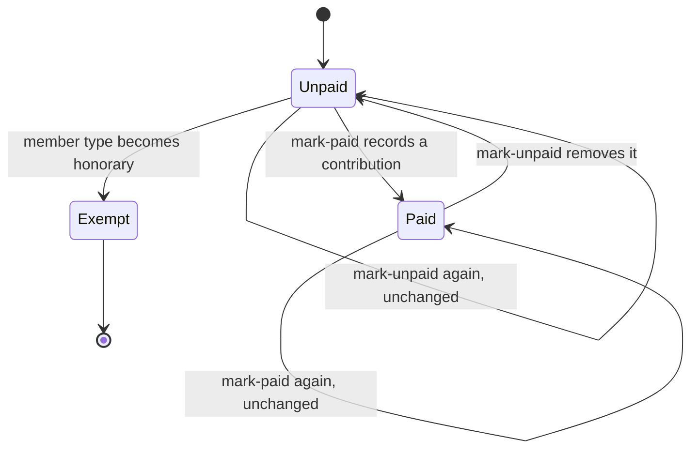
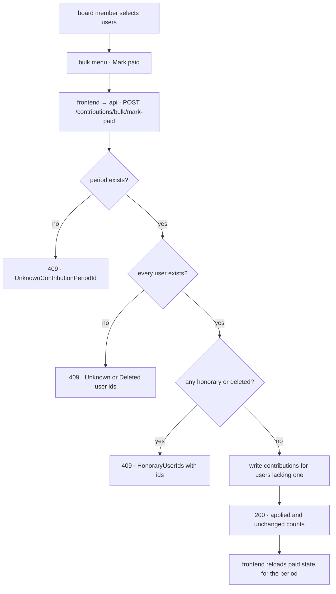
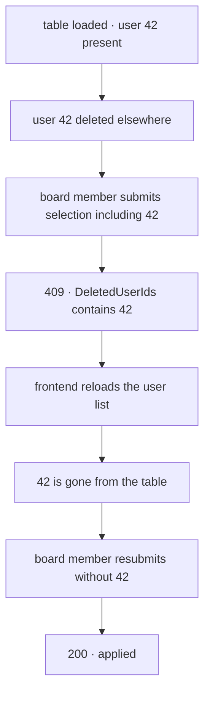

# Bulk contribution marking

## Scope

Covers a board member recording, or un-recording, contributions for many users at
once in a single contribution period, from selection in the user manager through to
the counts reported back.

Does not cover how a contribution period is created, how a single contribution is
recorded from a user's own page, or asking members for what they owe — that is
[payment emails](../payment-emails/README.md), which sends email and carries its own
audit rows. This flow only writes contribution records.

## Actors and entry points

A board member, from the user manager at `/user-manager`. They pick a contribution
period, select users with the row checkboxes, and choose Mark paid or Mark unpaid from
the bulk actions menu.

Nothing else enters this flow. There is no scheduled job and no external caller.

## States

A user is in one of three states for a given period. The state is the presence of a
`contributions` row keyed by user and period; there is no status column.

`Exempt` is not a stored state. An honorary member owes no contribution, so the
action refuses to touch them at all rather than recording one.

## Invariants

Each of these is defended by a scenario in
`tests/system/src/test/resources/features/bulk-contribution-marking.feature`.

- A selection is never partly applied. If any selected user cannot be acted on, no
  contribution is created or removed for any of them.
- A user that can no longer be acted on cannot be silently dropped from a selection.
  The request is refused and their id is returned.
- A deleted user never gains a contribution. Deletion anonymises the account and keeps
  the row for a restore window, so such an id still resolves; the deleted-user snapshot
  is what marks it unusable.
- An honorary member never gains a contribution record.
- Re-sending the same request never produces a second contribution row, and never
  reports the same row as applied twice.
- A count of `applied` never includes a user who was already in the requested state.

## The journey

1. The board member selects rows and picks the action. The dialog shows what it
   believes will happen, computed from the table already on screen.
2. The frontend posts the selected ids and the period id.
3. The period is checked first, because a missing period makes every other check
   meaningless.
4. Every selected id is resolved, and ids carrying a deleted-user snapshot are
   separated from ids that were never users. Both are collected rather than skipped.
5. Users that resolve are checked for honorary membership.
6. If anything was collected in steps 4 or 5, the request is refused whole with one
   error per reason, each carrying its ids.
7. Otherwise every selected user is written, skipping only those already in the
   requested state, and the counts are returned.

## Alternative orderings

The only ordering that varies is the operator's view of the table against the
database. A selection is built from a snapshot, and rows can change underneath it.

Deletion arriving after the request has begun is not a distinct ordering: the write
runs in one transaction, so the selection is resolved and applied against one
consistent view.

## Credentials

This flow issues nothing. It is authorised by the caller's existing session cookie
and requires write permission on `Contribution`, which board and treasurer roles
carry. No token is minted, transmitted out of band, or retired here.

## Endpoints

| | |
|---|---|
| Path | `POST /contributions/bulk/mark-paid` |
| Authorisation | `hasPermission('__NO_TARGET__', 'Contribution', 'write')` |
| Request | `{userIds: number[], contributionPeriodId: number}` — 1 to 1000 ids, all positive |
| Response 200 | `{applied, skipped, queued}` — `skipped` counts users already paid, `queued` is always 0 |
| Response 409 | `ProblemDetail` with `errors[]`, each `{objectName, field, message, code, values}` |
| Rate limit | None beyond the shared authenticated limit |

`POST /contributions/bulk/mark-unpaid` is identical in shape; `skipped` counts users
who had no contribution to remove.

The 409 codes are `UnknownUserIds`, `DeletedUserIds`, `HonoraryUserIds` and
`UnknownContributionPeriodId`. The `values` array carries the offending ids so the
caller can name the rows and reload them. 409 rather than 400 because the request is
well formed — the mismatch is between the caller's view and the database, which is a
reason to reload rather than to correct a form.

## Failure and recovery

**A user in the selection was deleted.** 409 with `DeletedUserIds`. Deletion
anonymises the account rather than removing the row, so the id still resolves and the
snapshot is what identifies it. The frontend
reloads the user list for the period, which removes the row, and the operator
resubmits. Nothing was written, so there is no partial state to unpick.

**An honorary member was selected.** 409 with `HonoraryUserIds`. The dialog already
marks such rows excluded, so this means the table was stale or the client was
bypassed. Recovery is the same: reload and resubmit.

**The period was deleted.** 409 with `UnknownContributionPeriodId`. The period picker
is reloaded.

**Duplicate submission.** The second request reports every row as unchanged and
writes nothing, because presence of a contribution row is the state.

**The client loses its state mid-action.** Nothing is held client-side beyond the
selection, so reloading the page is a complete recovery.

## Where the code lives

| Concern | File |
|---|---|
| Endpoints | `services/api/.../domain/contribution/web/ContributionBulkController.kt` |
| Request shapes | `services/api/.../domain/contribution/web/dto/request/BulkContributionRequest.kt` |
| Decision and writes | `services/api/.../domain/contribution/application/command/BulkContributionCommandHandlers.kt` |
| Refusal type and codes | `services/api/.../shared/dto/bulk/BulkSelectionRejected.kt` |
| 409 rendering | `services/api/.../platform/config/advice/BulkSelectionProblemDetailsAdvice.kt` |
| Selection and dialogs | `services/frontend/src/pages/management/UserManager.vue` |

## Testing

| Suite | Covers |
|---|---|
| `BulkContributionCommandHandlersTest` | The decision: every refusal reason, idempotence, de-duplication |
| `ContributionBulkControllerIT` | Both endpoints end to end, including the 409 body shape |
| `bulk-contribution-marking.feature` | The flows above, over HTTP against the running stack |

Scenario names in the feature file are mirrored by the integration test names, so the
correspondence can be checked by eye.
