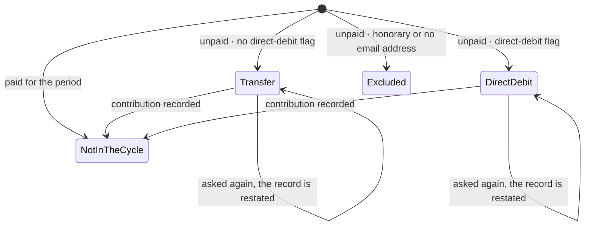
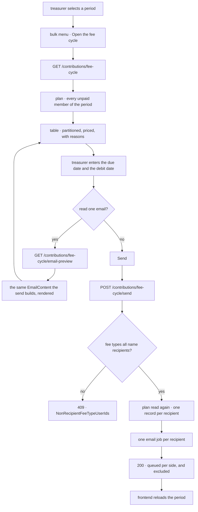
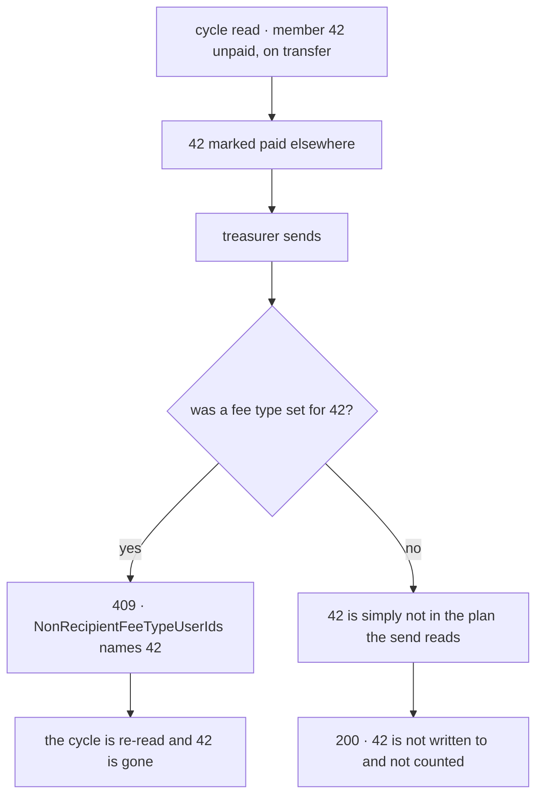

# The fee cycle

## Scope

Covers a treasurer asking every member of a contribution period who has not paid for
that year's contribution, in one operation: reading the cycle, reading one of the two
emails, and sending both statements from one confirmation.

Does not cover recording a contribution as paid — that is
[bulk contribution marking](../bulk-contribution-marking/README.md), the continuous
half of the same job — nor creating a contribution period, nor the single-member
reminder sent from a row, which quotes the period's fee options rather than one amount.

## Actors and entry points

A treasurer or board member, from the user manager at `/user-manager`. They select a
contribution period, then pick **Open the fee cycle** from the bulk actions menu.

The action needs a period and nothing else: unlike the paid and unpaid actions it is
not over a selection, so the row checkboxes have no bearing on it. Without a selected
period the menu entry is disabled, because there is no cycle without one.

Nothing else enters this flow. There is no scheduled job and no external caller.

## States

The cycle is not a stored state machine. It is a question asked of the data, and a
member is in one of these positions when it is asked.

Which of `Transfer` and `DirectDebit` a member is in is the `incasso` flag on the
membership that put them in the period. It is not a choice the treasurer makes, which
is why not having the flag is not a warning.

`Excluded` is not overridable. An honorary member owes nothing and an address that is
not on file cannot be written to, and neither is a judgement an operator can overrule.

## Invariants

Each of these is defended by a test named in the Testing section.

- An honorary member is never emailed by the cycle, and cannot be included.
- A member with no email address is never emailed, and never counted as sent to.
- A member who has paid for the period is never asked for it.
- The preview and the send never disagree about who is included, which side of the
  partition they are on, or what they owe. Both read one plan.
- No email quotes an amount without stating the reason that amount applies.
- No amount is ever typed. Every amount is the period's fee for a chosen fee type.
- A sent statement never changes what it is recorded as having said. Both the amount and
  the fee type are stored, so editing next year's fee cannot rewrite last year's email.
- A member on direct debit is never sent a payment request, and a member paying by
  transfer is never sent a pre-notification. Sending the wrong one costs the member
  money: a direct-debit member who transfers pays twice.
- A fee type naming a member the cycle does not write to is never silently ignored.
- Asking again never produces a second record for the same member and period.
- A member's last-asked date is never read from the other side of the partition.
- A member is never partitioned by the flag on a membership that has ended, where they
  hold one that has not.
- Reading an email writes no record and queues no send, and an email is never rendered
  for a member the cycle will not write to.

## The journey

1. The treasurer picks a period and opens the cycle.
2. The api plans it: every member whose membership overlapped the period, minus those
   with a contribution recorded for it, each one partitioned by the direct-debit flag on
   the membership judged for them — their active one where they hold one — and priced by
   the fee type that applies.
3. The table shows the partition with counts per group, each member's fee type and the
   amount it prices, and — for a member already asked — the date they were last asked
   on their own side, with a count of them above the table.
4. The treasurer enters a payment due date for the transfer group and a debit date for
   the direct-debit group. Both must be in the future.
5. They may change a member's fee type. The amount re-renders from the period without a
   round trip; there is no field for an amount.
6. They may read one member's email. Which of the two statements comes back is that
   member's own side of the partition, and it is built by the builder the send uses.
7. Sending re-reads the plan, writes one record per recipient and queues one email each.
8. The result reports each side separately, and how many members were excluded.

## Alternative orderings

The plan is read twice — once for the table and once by the send — so the data can
move in between.

A member who left the cycle without the treasurer having stated anything about them is
not an error: the send is about a period, not about a list of ids, so the answer is
simply the newer one. A member the treasurer *did* state a fee type for is different —
that statement now names somebody the send will not write to, and applying the rest
would leave the treasurer believing they had changed a fee they had not.

The send runs in one transaction, so a change arriving after it begins is not a
distinct ordering.

## Credentials

This flow issues nothing. It is authorised by the caller's existing session and needs
write permission on both `ContributionReminder` and `IncassoNotification`, which the
board role carries. No token is minted, transmitted out of band, or retired here.

The preview endpoint renders an email that carries the recipient's name and address, so
it is gated identically to sending one.

## Endpoints

| | |
|---|---|
| Path | `GET /contributions/fee-cycle?contributionPeriodId=` |
| Authorisation | write on `ContributionReminder` **and** `IncassoNotification` |
| Response 200 | `{contributionPeriodId, rows[]}` |
| Row | `{userId, name, memberType, memberSince, group, disposition, reason, feeType, amount, lastAskedOn}` |

| | |
|---|---|
| Path | `POST /contributions/fee-cycle/send` |
| Authorisation | as above |
| Request | `{contributionPeriodId, paymentDueDate, debitDate, feeTypeOverrides}` |
| Response 200 | `{paymentRequestsQueued, preNotificationsQueued, excluded}` |
| Response 409 | `ProblemDetail` with `errors[]`, code `NonRecipientFeeTypeUserIds`, `values` naming the ids |

| | |
|---|---|
| Path | `GET /contributions/fee-cycle/email-preview?contributionPeriodId=&userId=&paymentDueDate=&debitDate=&feeType=` |
| Authorisation | as above |
| Response 200 | `{group, feeType, subject, html, recipientEmail, recipientName}` |
| Response 404 | the member is not in this period's cycle, or the cycle sends them nothing |

`group` is `TRANSFER` or `DIRECT_DEBIT`. `feeType` is `FULL_YEAR_FEE`, `HALF_YEAR_FEE`
or `ALUMNI_FEE`; `feeType` on the preview request is optional and defaults to the one
that applies. `disposition` and `reason` come from the shared bulk vocabulary; the
cycle sets only `INCLUDED`, and `EXCLUDED` with `HONORARY` or `NO_EMAIL`.

Neither send endpoint takes a list of members. Sending is one request whatever the size
of the cycle.

## Failure and recovery

**A fee type names somebody the cycle no longer writes to.** 409 with
`NonRecipientFeeTypeUserIds` and the ids. Nothing was sent. The dialog re-reads the
cycle and names the members at fault, and the treasurer sends again.

**A member paid between the read and the send.** They are not in the plan the send
reads, so they are not written to and not counted. No refusal, because nothing the
treasurer stated was about them.

**A date is missing or not in the future.** The form refuses before the request, and
the api rejects a null with a validation error. Reading an email is unavailable until
both dates are given, because both reach the email.

**The cycle cannot be read.** The dialog says so and shows no rows, so an empty table
is never mistaken for a period with nobody left to ask.

**Sending twice.** The second send restates each record — amount, fee type, date and
`asked_at` — rather than adding a second, and queues the emails again. Re-sending is
allowed because the treasurer chases; it is warned about rather than blocked. The dialog
counts the already-asked members above the table and colours their date, and making them
rows to tick back in would mean a hundred ticks in the second cycle of the year.

**An email job fails.** The record was written before the send was queued, so a failed
delivery leaves a record and the job in the outbox rather than silently nothing.

**The client loses its state mid-action.** Nothing is held client-side but the two
dates and any changed fee types. Reopening the dialog re-reads the cycle.

## Where the code lives

| Concern | File |
|---|---|
| Endpoints | `services/api/.../contribution/web/FeeCycleController.kt` |
| Who is in the cycle, and what they owe | `services/api/.../contribution/domain/FeeCyclePlanner.kt` |
| The plan model | `services/api/.../contribution/domain/FeeCycle.kt` |
| Sending, and refusing a stray fee type | `services/api/.../contribution/domain/FeeCycleUseCases.kt` |
| Fee type and amount from the period | `services/api/.../contribution/domain/FeeResolution.kt` |
| The payment request | `services/api/.../contribution/domain/ContributionReminderEmailBuilder.kt` |
| The pre-notification | `services/api/.../contribution/domain/IncassoNotificationEmailBuilder.kt` |
| Rendering one for reading | `services/api/.../contribution/domain/FeeCycleEmailPreviewService.kt` |
| The two records | `services/api/.../contribution/persistence/{ContributionReminder,IncassoNotification}.kt` |
| The two dates, as one value | `services/api/.../contribution/domain/FeeCycle.kt` |
| The dialog | `services/frontend/src/components/common/modals/bulk/FeeCycleDialog.vue` |
| Rows, and only the changed fee types | `services/frontend/src/utils/feeCycle.ts` |

## Testing

| Suite | Covers |
|---|---|
| `FeeCyclePlannerTest` | Who is in the cycle: the partition, both exclusions, paid members absent, the judged membership, last-asked per side |
| `FeeCycleUseCasesTest` | The send: both sides written and reported separately, restating a record, refusing a stray fee type |
| `FeeResolutionTest` | The cutoff boundary in both directions, and that the cutoff comes from the period |
| `ContributionReminderEmailBuilderTest`, `IncassoNotificationEmailBuilderTest` | The rendered bodies: the amount, the reason, the date, and that the pre-notification asks for no transfer |
| `FeeCycleEmailPreviewServiceTest` | Each side reads its own statement, an override is quoted, and the render goes through the shared renderer |
| `FeeCycleControllerIT` | All three endpoints end to end, the 409 body, the authorisation, and that the send writes to exactly the members the preview named |
| `FeeCycle.test.ts`, `feeCycle.test.ts` | The dialog: both sides shown and counted, live re-pricing, only changed fee types sent, a refusal reported rather than closed on, the recipient chooser |

The preview-and-send agreement is asserted directly: `FeeCycleControllerIT` reads the
preview, derives the expected recipients per side from its rows, then asserts the send
wrote exactly those.
