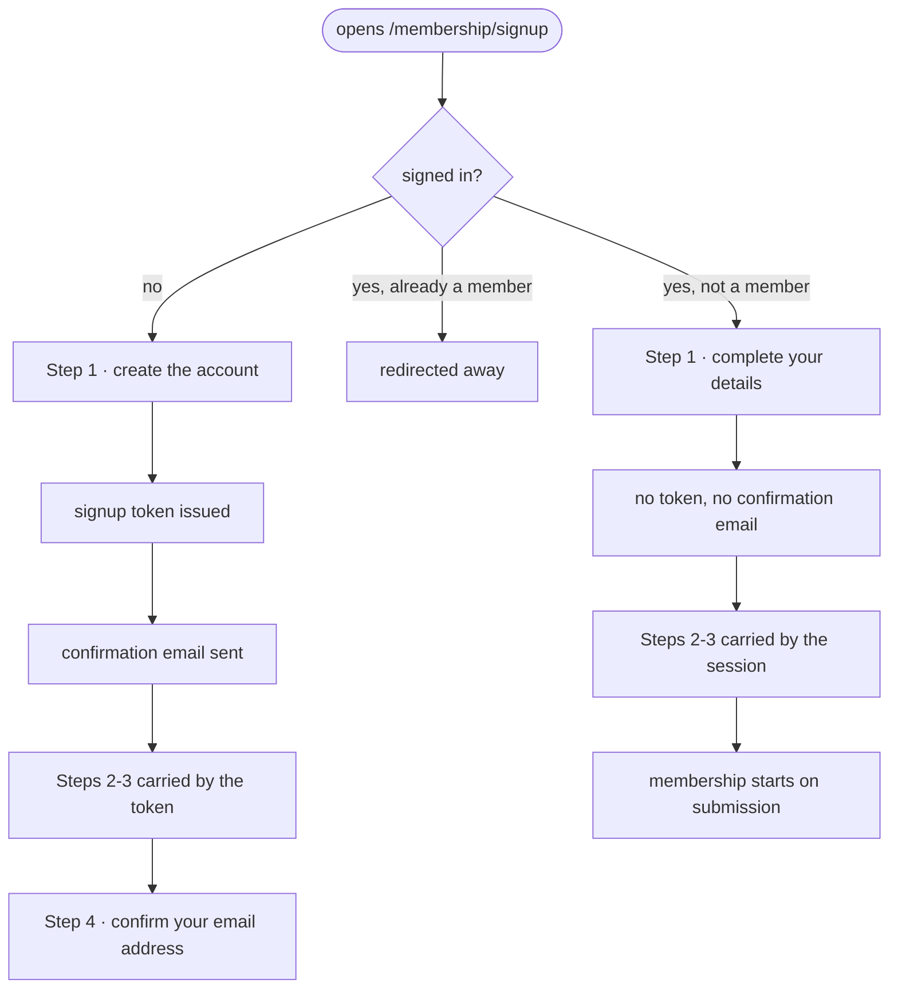
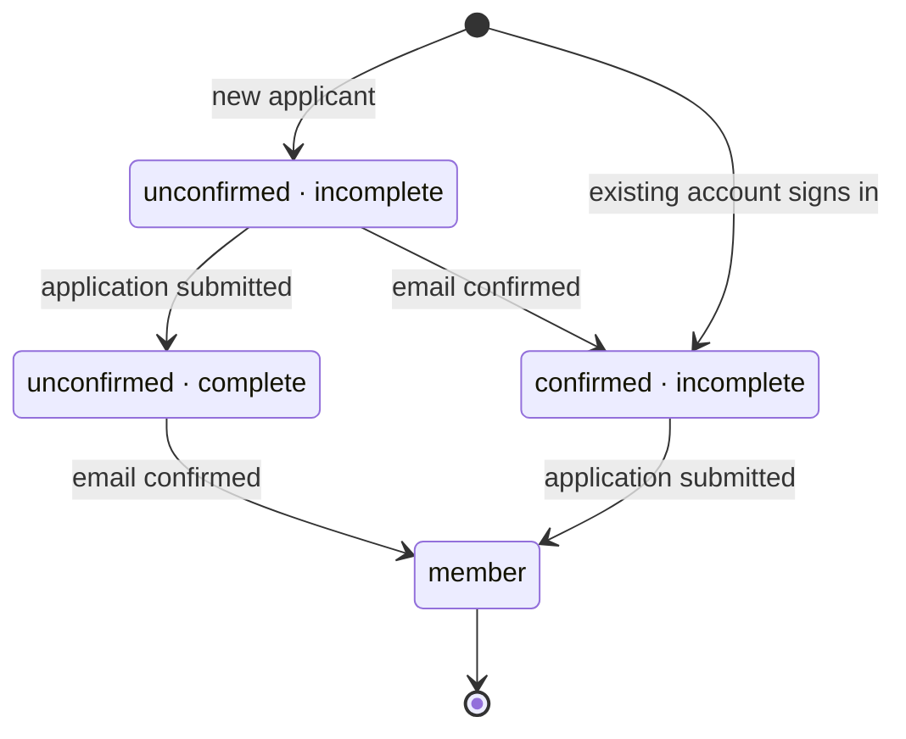
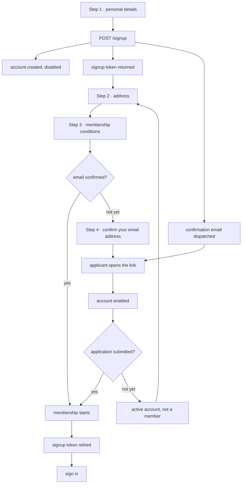
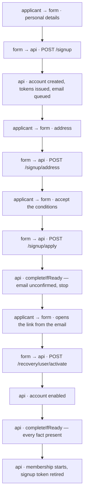
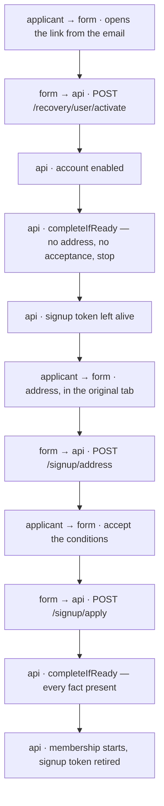
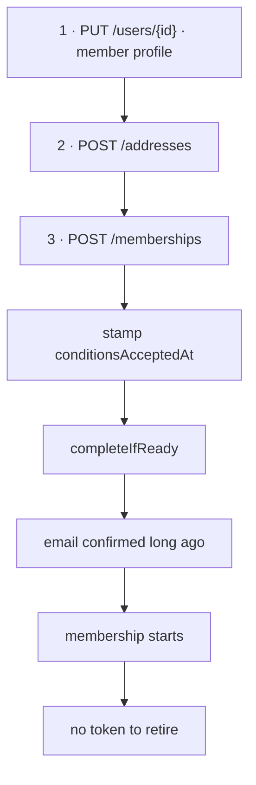
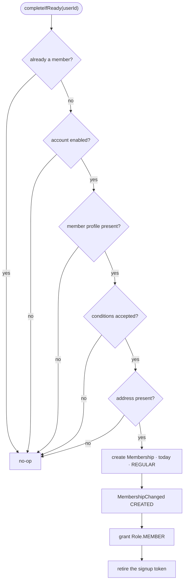
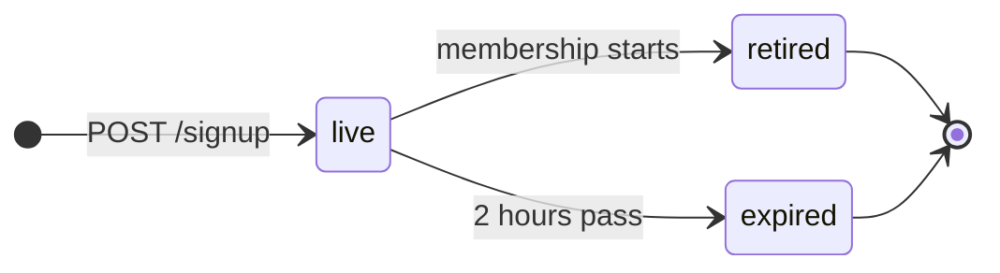

# Membership Signup

A prospective member fills in one form and ends up with an enabled account and an
active membership. Nothing in the middle of the form requires them to leave the site.

The form serves two applicants: somebody with no account yet, who takes four steps and
confirms their email address at the end, and somebody who already has an account and is
joining now, who takes three and confirms nothing.

## Scope

Covers public self-service signup at `/membership/signup`, the account it creates,
the address and membership application attached to it, and the email confirmation
that activates both.

Also covers plain account creation at `/account/create`, which is the same flow
without a member profile and therefore without a membership at the end.

Does **not** cover:

- **Board-created accounts.** A board member creating an account on someone's
  behalf issues a `MEMBER_ACTIVATION` token and sends the recipient to
  `/account/activate/member` to choose a username and password. Different token
  purpose, different page, different email.
- **Password reset.** Shares the `recovery_tokens` table and nothing else.
- **Contributions and incasso.** Membership creation does not generate a
  contribution. The board creates those separately.

## Actors and entry points

`/membership/signup` serves two kinds of applicant, and which one is at the keyboard
changes the flow substantially.

| Applicant | Signed in | Email confirmed | Needs a signup token | Gets a confirmation email |
|-----------|-----------|-----------------|----------------------|---------------------------|
| **New** — no account yet | no | not yet | yes | yes |
| **Existing** — has an account, wants to join | yes | already | no | no |

The second row exists because an account and a membership are separate things. Someone
who made an account years ago to sign up for events, or who was created as a guest, can
decide to become a member later. They already proved they can read their email when they
activated the account, so making them prove it again would be theatre.

That split is clean because of one property of the login path:
`UserAuthenticationProvider` throws `DisabledException` for an account with
`enabled = false`, so **being signed in already means the email address was confirmed**.
An applicant is therefore never both signed in and unconfirmed, and the flow never has
to handle that combination.

Other entry points into the same account lifecycle:

| Actor | Entry point | Outcome |
|-------|-------------|---------|
| Prospective account holder | `/account/create` | Enabled account, no membership |
| A new applicant, from their inbox | `/account/activate/user#token=…` | Email address confirmed |

Both `/membership/signup` and `/account/create` are reachable without authentication
and both register through `POST /signup`. A board member creating an account on
somebody else's behalf uses `POST /users`, a different endpoint under a different
permission.

## States

An account moves through two independent axes: whether its email address is
confirmed, and whether its membership application is complete. Membership is the
product of both.

The two axes are independent, so the four states form a lattice: an applicant can
reach `Member` along any inbound edge, and the two middle states are where they wait
for the other half.

A new applicant enters at `unconfirmed · incomplete` and has both facts still to
establish. An existing signed-in applicant enters at `confirmed · incomplete` — one
fact is already true — and has only to submit the application. Nobody ever enters at
`unconfirmed · complete`; that state is only reachable by submitting an application
before confirming.

| State | `users.enabled` | Can sign in | Is a member | Signup token |
|-------|-----------------|-------------|-------------|--------------|
| Email unconfirmed, application incomplete | `false` | no | no | live |
| Email unconfirmed, application complete | `false` | no | no | live |
| Email confirmed, application incomplete | `true` | yes | no | live |
| Member | `true` | yes | yes | retired |

The two middle rows are both legitimate resting states. An applicant who confirms
their email early sits in row three with a working account and no membership, and
that is correct — confirming an address says nothing about wanting to join.

## Invariants

Each of these is a thing that cannot happen, and each is covered by a scenario in
the [acceptance features](../../../services/system-tests/src/test/resources/features/)
— see [Testing](#testing).

1. **No membership without a confirmed email address.** A `Membership` row implies
   the account's email address was proven reachable.
2. **No membership without an address, a member profile and a recorded acceptance
   of the membership conditions.** All four facts are re-read from the database at
   commit time; none is trusted from a token or a JWT claim.
3. **At most one membership per signup.** Submitting the application twice, or
   confirming an email twice, cannot produce two memberships.
4. **A signup token authorises three writes against one account.** It can save an
   address, submit that account's application, and correct that account's email
   address while the account is unconfirmed. It cannot read the account back,
   change a password, act on a different account, or satisfy any `@PreAuthorize`
   guard elsewhere in the API.
5. **Confirming an email address never blocks finishing the application.** The
   signup token outlives confirmation.
6. **A signed-in applicant is never asked to confirm an email address.** Signing in
   requires `enabled = true`, so the address is already proven; no signup token is
   issued and no confirmation email is sent for that path.
7. **Nobody applies for a membership they already hold.** A signed-in applicant who is
   already a member is redirected away from the form.

## The journey

1. **Personal details.** `POST /signup` creates the user disabled, creates the
   member profile, issues a `SIGNUP_CONTINUATION` token in the response body and a
   `USER_ACTIVATION` token by email. The confirmation link is live from this moment.
2. **Address.** `POST /signup/address` under the signup token.
3. **Membership conditions.** `POST /signup/apply` records the acceptance, then
   runs the completion check.
4. **Confirm your email address.** Names the address the email went to, offers to
   correct it, and hands off to sign-in. If the address was already confirmed
   during steps 2–3, this page says the membership has started instead.

Opening the confirmation link enables the account and runs the same completion
check. Whichever of the two runs last is the one that creates the membership.

## Alternative orderings

The confirmation link is live from step 1, so confirmation and application
submission are independent events that arrive in either order.

### Application submitted first

The common order. The applicant works through the form and confirms afterwards.

### Email confirmed first

The applicant sees the email arrive mid-form and clicks it.

Because either write can be the one that completes the set, neither response can
assume its own ending. Both return the outcome and the page composes the sentence.

### Already signed in

No token, no confirmation email, and the membership starts as soon as the application
is submitted, because the other half of the rendezvous was settled when the account was
activated — possibly years earlier.

The applicant sees three steps rather than four: there is no email to confirm, so the
stepper ends on the membership step and reports that the membership has started.

## The completion rule

`SignupCompletionService.completeIfReady(userId)` is the single place the membership
is created. It is called at the end of each of the three writes that could supply the
last missing precondition — `POST /signup/apply`, `POST /memberships` and
`POST /recovery/user/activate` — and it is idempotent.

A missing member profile is the plain-account case: `/account/create` never creates
one, so those accounts confirm their email and stop, which is the intended ending.

## Credentials

Both tokens exist only for the new-applicant path. A signed-in applicant is issued
neither.

| | Signup continuation | User activation |
|---|---|---|
| Purpose | Carry an applicant through steps 2–3 without a session | Prove the applicant controls the email address |
| `TokenPurpose` | `SIGNUP_CONTINUATION` | `USER_ACTIVATION` |
| Sent out of band | Never — returned in the `POST /signup` response body | Yes, by email |
| Client holds it | `sessionStorage`, one tab, never placed in a URL | URL fragment, then `sessionStorage`, then discarded |
| TTL | 2 hours | 1 hour |
| Uses | Many, within the TTL | Exactly one |
| Authorises | Save address · submit application · correct email — on its own account only | Enable the account |
| Retired by | The membership starting, or expiry | Consumption, or expiry |

Both are `selector.verifier` records in `recovery_tokens`: a 128-bit selector
identifies the row, a 256-bit verifier is stored BCrypt-hashed and compared on
presentation.

Correcting the email address consumes every outstanding `USER_ACTIVATION` token for
the account before issuing the replacement, so the link already delivered to the
mistyped address stops working. That matters because a mistyped address may be
somebody else's inbox, and a link that still enables the account would hand them
the account. Resending to the address already on file does not need the same
treatment: both links point at the same inbox.

`live` has exactly two exits, and confirming the email address is neither of them.
Saving an address, submitting the application, correcting the email address and
confirming the email address all leave the token in `live`.

`X-Signup-Token` is listed in the CORS allowed headers in `SecurityConfig`. Apex
production serves the frontend and the api on one origin so no preflight happens
there, but every dev and CI stack splits them across ports, and a preflight that
refuses the header stops the browser from ever sending the request.

The token is single-**purpose**, not single-**use**. Going back a step, retrying
after a dropped connection and double-clicking submit all present the same token
again, and all must work.

## Endpoints

| Method | Path | Authorisation | Notes |
|--------|------|---------------|-------|
| `POST` | `/signup` | `@PermitAll` | Body `CreateUserRequest`. Returns `SignupSessionResponse { userId, email, signupToken, expiresAt }`. 10/min per client. |
| `POST` | `/signup/address` | `X-Signup-Token` | Body `SignupAddressRequest` — no `userId`; the account comes from the token. `204`, upsert. 10/min. |
| `POST` | `/signup/apply` | `X-Signup-Token` | Body `{ conditionsAccepted }`. Records the acceptance, runs `completeIfReady`. Returns `{ emailConfirmed, membershipStarted }`. Idempotent. 10/min. |
| `PATCH` | `/signup/email` | `X-Signup-Token` | Body `{ email }`. Re-issues the activation token and resends. Refused once the account is enabled. 3/10min. |
| `POST` | `/recovery/user/activate` | `@PermitAll` | Body `{ token }`. Enables the account, runs `completeIfReady`. Returns `{ membershipStarted }`. 10/10min. |
| `POST` | `/recovery/user/activate/resend/{username}` | `@PermitAll` | Resends to the address on file. 5/10min. |
| `POST` | `/users` | `hasPermission('__NO_TARGET__', 'User', 'write')` | Board-only account creation. |
| `POST` | `/memberships` | `hasPermission(#principal.id, 'User', 'write')` | The signed-in applicant's submission. Body `{ conditionsAccepted }`; stamps the acceptance, then runs the same `completeIfReady`. Returns `{ emailConfirmed, membershipStarted }`. |
| `PUT` | `/users/{id}` | `hasPermission(#id, 'User', 'write')` | The signed-in applicant's step 1: fills in the member profile on an existing account. |
| `POST` | `/addresses` | `hasPermission(#request.userId, 'User', 'write')` | The signed-in applicant's step 2. |

Rate limits are declared in `PublicAuthRateLimitFilter`, keyed per client for
anonymous paths.

The token-scoped endpoints write and acknowledge; none of them reads account state
back to the caller beyond the two booleans that describe what just happened.

## Failure and recovery

**Signup token expired.** The step reports that the signup session expired and
points at email confirmation followed by sign-in. Everything already saved stays
saved.

**Tab closed, token lost.** The applicant confirms their email, signs in, and returns
to `/membership/signup`. They are now indistinguishable from an existing signed-in
applicant: the form loads whatever is already on the account and resumes at the first
unfinished step, and `POST /memberships` runs the same completion check. This is why
the signed-in path is a first-class route rather than a fallback — recovering from a
lost tab is the same code path as joining years after making an account.

**Wrong email address.** `PATCH /signup/email` while the account is unconfirmed. It
changes the address, invalidates the link that went to the wrong one, and sends a
fresh one. The address and the recorded acceptance are untouched, so a typo does not
cost the applicant the form. Once the account is enabled the address is changed
through the normal account settings, under a session.

**Application submitted twice.** `completeIfReady` returns without acting when an
active membership already exists.

**Application never finished.** The account stays as it is. A confirmed one can
sign in and is not a member. An unconfirmed one cannot sign in. Neither appears in
the member list. There is no automatic cleanup of abandoned signups.

## Where the code lives

**API**

| Concern | Location |
|---------|----------|
| Signup endpoints | `domain/auth/web/SignupController.kt` |
| Token issue, verify, retire | `domain/auth/application/SignupTokenService.kt` |
| The completion rule | `domain/auth/application/SignupCompletionService.kt` |
| Activation | `domain/auth/application/UserActivationService.kt`, `domain/auth/web/RecoveryController.kt` |
| Token record and purposes | `domain/auth/persistence/RecoveryToken.kt`, `shared/enums/TokenPurpose.kt` |
| Emails | `domain/auth/application/email/RecoveryEmailBuilders.kt` |
| Acceptance of conditions | `domain/user/persistence/MemberProfile.kt` (`conditionsAcceptedAt`) |
| `Role.MEMBER` on membership change | `domain/user/application/listener/MembershipEventListener.kt` |
| Rate limits | `infrastructure/security/PublicAuthRateLimitFilter.kt` |

**Frontend**

| Concern | Location |
|---------|----------|
| The stepper, the confirmation step and the correction form | `src/pages/membership/MembershipSignUp.vue` |
| Plain account creation | `src/pages/login/CreateAccount.vue` |
| Email confirmation landing page | `src/pages/activate/ActivateUser.vue` |
| Step forms, each taking an optional `signupToken` | `src/components/form/{UserForm,AddressForm,MembershipForm}.vue` |
| Token extraction from a URL | `src/plugins/recoveryToken.ts` |
| API client | `src/services/api/blueshell/` — generated, never hand-edited |

The continuation token is held in `sessionStorage` under
`signup:continuation:token` and dropped the moment the membership starts. Which
step the applicant is on is internal state, not a URL parameter: a step cannot be
reached by typing an address, so no step needs to guard itself.

## Testing

Behaviour is specified as Cucumber features that run against the compose stack,
so the specification and the test are the same artefact rather than two documents
that drift:

| Feature | Covers |
|---------|--------|
| [`account-registration.feature`](../../../services/system-tests/src/test/resources/features/account-registration.feature) | An account is unusable until its address is confirmed, and confirming is not joining |
| [`membership-join-with-account.feature`](../../../services/system-tests/src/test/resources/features/membership-join-with-account.feature) | The signed-in path: no token, no confirmation email, membership on submission |
| [`membership-eligibility.feature`](../../../services/system-tests/src/test/resources/features/membership-eligibility.feature) | The preconditions, as an `Examples` table, plus submit-twice idempotency |
| [`membership-join-new-applicant.feature`](../../../services/system-tests/src/test/resources/features/membership-join-new-applicant.feature) | The new-applicant path, both arrival orders, and correcting a mistyped address |
| [`signup-session-scope.feature`](../../../services/system-tests/src/test/resources/features/signup-session-scope.feature) | What a signup session may and may not do |
| [`zz-harness-selfcheck.feature`](../../../services/system-tests/src/test/resources/features/zz-harness-selfcheck.feature) | That the suite ran at all, so a green job cannot mean an empty one |

Run them with `./gradlew :services:system-tests:acceptanceTest` against a running
stack. They are their own CI job (`acceptance-features`) and carry no browser, so
the suite is fast. Every scenario runs; nothing is tagged `@pending`.

Conventions for writing them are in
[the features README](../../../services/system-tests/src/test/resources/features/README.md).

Browser-level coverage of the same screens lives alongside, in the JUnit system
tests, which exercise what the acceptance features deliberately do not — that the
pages render and the steps are reachable by clicking:

| Suite | Location | Covers |
|-------|----------|--------|
| Browser system tests | `services/system-tests/src/test/kotlin/.../frontend/membership/` | The stepper as a user drives it, both applicant types, the correction form |
| Frontend e2e | `services/frontend/tests/e2e/membership-signup.spec.ts` | Validation gates and that each write carries the token header |
| Unit (Vue) | `services/frontend/tests/unit/pages/membership/MembershipSignUp.test.ts` | Step progression and both endings of the flow |
| API unit | `services/api/src/test/.../auth/application/` | `completeIfReady` branches, token scope and expiry |
| API integration | `services/api/src/integrationTest/.../auth/web/` | The endpoints end to end, including the correction path |

## Related documentation

- [ADR-024: Scoped Signup Continuation Tokens](../../adr/api/ADR-024-scoped-signup-continuation-tokens.md)
- [ADR-025: Membership Commit Rendezvous](../../adr/api/ADR-025-membership-commit-rendezvous.md)
- [ADR-014: Permission Evaluation Strategy](../../adr/api/ADR-014-permission-evaluation-strategy.md)
- [Flow documentation index](../README.md)
