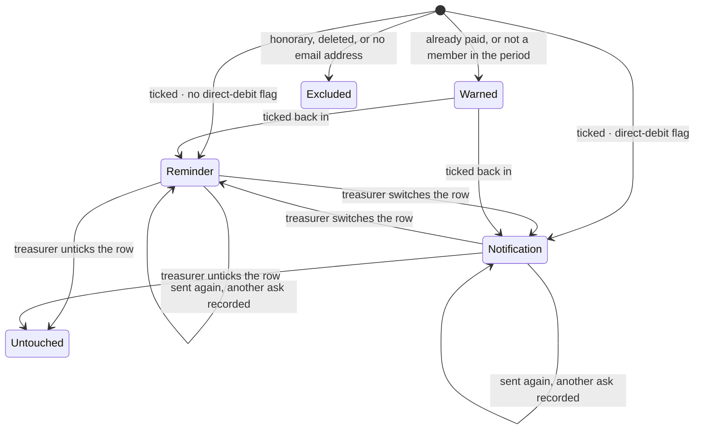
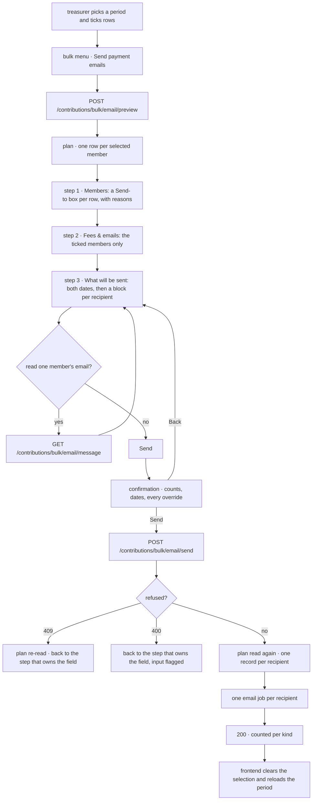
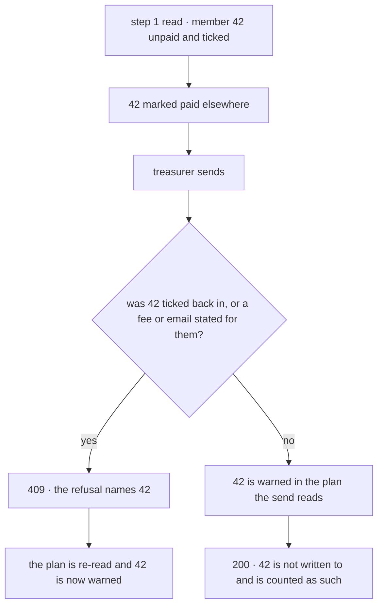

# Payment emails

## Scope

Covers a treasurer asking a selection of members for what they owe for one contribution
period: choosing who the batch writes to, what each of them gets, reading one of the emails,
and sending them all from one confirmation.

Does not cover recording a contribution as paid — that is
[bulk contribution marking](../bulk-contribution-marking/README.md), the continuous half of
the same job — nor creating a contribution period, nor the single-member reminder sent from
a row, which quotes the period's fee options rather than one amount.

## Actors and entry points

A treasurer or board member, from the user manager at `/user-manager`. They select a
contribution period, tick rows with the row checkboxes, then pick **Send payment emails**
from the bulk actions menu. Without both a period and a selection the menu entry is
disabled: there is nothing to bill for, or nobody to bill.

Nothing else enters this flow. There is no scheduled job and no external caller.

## States

Not a stored state machine. A member is in one of these positions when the question is
asked of the data, and every position is visible on the first step.

`Excluded` is not overridable. An honorary member owes nothing, a deleted account is nobody
to write to, and an address that is not on file cannot be written to; none of the three is a
judgement an operator can overrule, and a tick box on such a row would be a promise the tool
cannot keep.

`Warned` is a default, not a rule. A contribution recorded in error and a membership
backdated by hand are both real, so the operator can tick either row back in.

Which of `Reminder` and `Notification` a member starts in is the `incasso` flag on the
membership judged for them. That is a default too: a mandate that failed this morning is
chased by transfer, and no flag knows that yet.

## Invariants

Each of these is defended by a test named in the Testing section.

- An honorary member is never emailed, and cannot be ticked back in.
- A member with no email address is never emailed, and cannot be ticked back in.
- A deleted account is never emailed, and cannot be ticked back in.
- A member who has already paid is never emailed unless the operator says so explicitly.
- The Send-to box is the selection. A member the box is not ticked for is never written to,
  whatever the api would have decided about them.
- The table and the send never disagree about who is written to, which email they get, or
  what they owe. Both read one plan.
- No email quotes an amount without stating the reason that amount applies.
- No amount is ever typed. Every amount is the period's fee for a chosen fee type.
- A sent email never changes what it is recorded as having said. Both the amount and the fee
  type are stored, so editing next year's fee cannot rewrite last year's email.
- A member is never sent both emails by one send.
- A fee type, or a chosen email, naming a member the send does not write to is never
  silently ignored.
- An id in the selection that is not a user is refused, never dropped into a count.
- A selection naming the same member twice is refused, never collapsed.
- A member ticked back in is refused when the send still would not write to them, and when
  the selection does not name them at all.
- No email promises a date that has already passed, and none promises one before the period
  starts or more than three months after it ends. Both rules hold whether the request came
  from the wizard or from anything else.
- Every refusal names the request field it is about, so the wizard can land the treasurer on
  the step that owns it with the rows or the input marked.
- A refused send writes nothing. There is no half-sent batch.
- An ask is never lost to a later one. A member can be asked as often as the treasurer
  needs, and each ask is its own record with its own moment.
- A member's last-sent date is never read from the other email, and is always the most
  recent of their asks of that kind.
- A member is never judged by the flag on a membership that has ended, where they hold one
  that has not.
- An email is never announced without the date it promises: a payment due date is required
  exactly when somebody is being asked to transfer, a debit date exactly when somebody is
  being told when the money moves.
- Reading an email writes no record and queues no send, and an email is never rendered for a
  member the send will not write to.
- Nothing is ever sent from a step alone. The confirmation stands between Send and the
  request, and backing out of it sends nothing.

## The journey

The send is three steps, each asking one question, then a confirmation. The stepper header
is clickable back to any step already reached, and every choice survives moving between them.

1. The treasurer picks a period, ticks the members, and opens the action.
2. The api plans it: one row per selected member, each partitioned by the direct-debit flag
   on the membership judged for them — their active one where they hold one — and priced by
   the fee type that applies.
3. **Step 1, Members.** One Send-to box per row, and that box is the selection. Members the
   api would write to start ticked, members it warns about start unticked, and members it
   cannot write to have no box. A reason sits on every row that is warned about or cannot be
   emailed. Unticking everybody stops the wizard here.
4. **Step 2, Fees & emails.** Only the members still ticked. Each row states which email that
   member gets and which fee prices it, both changeable, with the amount and the date they
   were last sent that same email. Changing either raises a banner above the table naming the
   members and saying what the change means — separately for the two, because the wrong email
   can make a member pay twice while the wrong fee bills the wrong amount.
5. **Step 3, What will be sent.** The payment due date and the debit date, then a block per
   recipient: their name, the email they get, the fee type and the amount, and a Preview that
   renders that member's actual email. A date nobody in the batch needs is optional and says
   why.
6. Send does not send. It opens a confirmation: chips for how many of each email, the dates
   they carry and how many of the selected members are left alone, then the overrides grouped
   into one warning — ticked back in, switched, charged another fee type, already sent this
   before. Back returns to step 3 with everything intact.
7. Confirming re-reads the plan, writes one record per recipient — a new one each time — and
   queues one email each.
8. The result reports each kind separately, and how many were not written to.

## Refusal routing

Every refusal carries the request field it is about, and the wizard routes on that field
alone. The confirmation closes on any refusal; a 409 re-reads the plan first, because it
means the plan has moved. Re-reading keeps every tick, fee type and email kind whose member
is still in the new plan and still reachable — a member the refusal named loses theirs,
because the plan has just contradicted it.

| Field | Step | Codes |
|---|---|---|
| `userIds` | 1 — the rows it named are marked | `UnknownUserIds`, `DuplicateUserIds` |
| `forciblyIncludedUserIds` | 1 — the rows it named are marked | `NonRecipientForcedUserIds`, `UnknownForcedUserIds`, `Size` |
| `kindOverrides` | 2 | `NonRecipientEmailKindUserIds`, `Size` |
| `feeTypeOverrides` | 2 | `NonRecipientFeeTypeUserIds`, `Size` |
| `paymentDueDate`, `debitDate` | 3 — the input itself is flagged | `DateRequired`, `DateOutsideContributionPeriod`, `Future` |

A refusal naming more than one field lands on the earliest step of them, because correcting
that is what the later ones are read against.

Per ADR-026 the sentence the operator reads for a new code is composed in the browser from
the code, not taken from the api's `message`, and the api's `message` for those codes is
fixed per code and interpolates nothing. The older codes keep the message the api composes
for them; rewriting those would touch four other dialogs for no benefit here.

## Alternative orderings

The plan is read twice — once for the table and once by the send — so the data can move in
between.

A member who became warned without the treasurer having stated anything about them is not an
error: the send re-decides, and the answer is simply the newer one. A member the treasurer
*did* state something for is different — that statement now names somebody the send will not
write to, and applying the rest would leave the treasurer believing they had changed
something they had not.

The send runs in one transaction, so a change arriving after it begins is not a distinct
ordering.

## Credentials

This flow issues nothing. It is authorised by the caller's existing session and needs write
permission on both `ContributionReminder` and `IncassoNotification`, which the board role
carries. Both, on every endpoint, because one send writes both records. No token is minted,
transmitted out of band, or retired here.

The message endpoint renders an email carrying the recipient's name and address, so it is
gated identically to sending one.

## Endpoints

| | |
|---|---|
| Path | `POST /contributions/bulk/email/preview` |
| Authorisation | write on `ContributionReminder` **and** `IncassoNotification` |
| Request | `{contributionPeriodId, userIds[]}` — 1 to 1000 ids, all positive |
| Response 200 | `{contributionPeriodId, rows[]}` |
| Row | `{userId, name, memberType, memberSince, disposition, reason, defaultKind, feeType, amount, lastRemindedOn, lastNotifiedOn}` |

| | |
|---|---|
| Path | `POST /contributions/bulk/email/send` |
| Authorisation | as above |
| Request | `{contributionPeriodId, userIds[], forciblyIncludedUserIds[], kindOverrides, paymentDueDate, debitDate, feeTypeOverrides}` |
| Response 200 | `{remindersSent, incassoNotificationsSent, notWrittenTo}` |
| Response 400 | `ProblemDetail` with `errors[]` of `{objectName, field, message, code}` — a bean constraint, or a date rule that needed the period |
| Response 409 | the same `errors[]`, plus `values` naming the offending ids — a selection that no longer matches the data |

| | |
|---|---|
| Path | `GET /contributions/bulk/email/message?kind=&contributionPeriodId=&userId=&date=&feeType=` |
| Authorisation | as above |
| Response 200 | `{kind, feeType, subject, html, recipientEmail, recipientName}` |
| Response 404 | the member could not be read, or this send writes nothing to them |

`kind` is `REMINDER` or `INCASSO_NOTIFICATION`; on the message request it is whichever the
row is currently set to, so a switched row previews what it will actually get. `feeType` is
`FULL_YEAR_FEE`, `HALF_YEAR_FEE` or `ALUMNI_FEE`, and is optional on the message request,
defaulting to the one that applies. `disposition` and `reason` come from the shared bulk
vocabulary; this flow sets `INCLUDED`, `WARNING` with `ALREADY_PAID` or
`NOT_MEMBER_IN_PERIOD`, and `EXCLUDED` with `HONORARY`, `DELETED` or `NO_EMAIL`.

Both dates are optional on the wire and required by what the batch turns out to send, which
is why a missing one is refused above the web layer rather than by the request shape.

`notWrittenTo` reads 0 for a wizard-driven send, because the wizard sends only the ticked
rows. It stays for direct callers, which may name members the send skips.

## Failure and recovery

**A statement names somebody the send no longer writes to.** 409 naming the ids. Nothing was
sent. The wizard re-reads the plan, returns to the step that owns the field, and marks the
rows at fault.

**An id in the selection is not a user, or is named twice.** 409 against `userIds`. Back to
step 1 with those rows marked. Both mean the selection the client holds and the one the api
holds have parted company, so the plan is re-read before the marks are shown. The read names
such an id too, in `unknownUserIds`, so the counts add up to the selection before Send rather
than after it.

**A member ticked back in is one the send still will not write to.** 409 against
`forciblyIncludedUserIds`. Back to step 1. The wizard cannot produce this itself — a
hard-excluded member has no box — so it means the member became unreachable after the plan
was read.

**A date is missing, has passed, or falls outside the period.** 400 against that date's own
field. The wizard returns to step 3 and turns that input red, and the message clears as soon
as the date is changed. The browser enforces the same three rules before the request, so this
is the direct caller's path and the browser's safety net.

**A member became warned between the read and the send.** They are not written to and are
counted among those that were not. No refusal, because nothing the treasurer stated was
about them.

**A date nobody needs is missing.** Nothing happens. The field says why it is empty, and the
send does not ask for it.

**The plan cannot be read.** The wizard says so and shows no rows, so an empty table is
never mistaken for a selection with nobody left to ask.

**Sending twice, or five times.** Each send writes its own ask and queues its own email.
Re-sending is allowed as often as the treasurer needs — chasing is the job — so
`contribution_reminders` and `incasso_notifications` hold a row per ask rather than per
member and period, and the table reads the most recent of them.

**An email job fails.** The record was written before the send was queued, so a failed
delivery leaves a record and the job in the outbox rather than silently nothing.

**The operator changes their mind at the confirmation.** Back returns to step 3 with every
choice intact. Nothing was sent, because nothing is sent until the confirmation is answered.

**The client loses its state mid-action.** Nothing is held client-side but the ticks, the two
dates and any switched rows or changed fee types. Reopening the wizard re-reads the plan.

## Where the code lives

| Concern | File |
|---|---|
| Endpoints | `services/api/.../contribution/web/BulkContributionEmailController.kt` |
| Request DTOs and their bean constraints | `services/api/.../contribution/web/BulkContributionEmailRequest.kt` |
| Who is written to, with which email, and what they owe | `services/api/.../contribution/domain/ContributionEmailPlanner.kt` |
| The plan model | `services/api/.../contribution/domain/ContributionEmail.kt` |
| Sending, and every refusal it makes | `services/api/.../contribution/domain/BulkContributionEmailUseCases.kt` |
| Fee type and amount from the period | `services/api/.../contribution/domain/FeeResolution.kt` |
| The contribution reminder | `services/api/.../contribution/domain/ContributionReminderEmailBuilder.kt` |
| The incasso notification | `services/api/.../contribution/domain/IncassoNotificationEmailBuilder.kt` |
| Rendering one for reading | `services/api/.../contribution/domain/ContributionEmailMessageService.kt` |
| The two records, one row per ask | `services/api/.../contribution/persistence/{ContributionReminder,IncassoNotification}.kt` |
| Refusal shapes, 409 and 400 | `services/api/.../shared/dto/bulk/{BulkSelectionRejected,BulkFieldRejected}.kt` |
| The wizard, and where a refusal lands | `services/frontend/src/components/common/modals/bulk/paymentEmail/PaymentEmailWizard.vue` |
| The three steps | `services/frontend/src/components/common/modals/bulk/paymentEmail/PaymentEmail{Members,Fees,Review}Step.vue` |
| Routing, counting, the period-bounds mirror, and only what changed | `services/frontend/src/utils/contributionEmail.ts` |
| Reading a refusal out of either status | `services/frontend/src/utils/bulkRejection.ts` |

## Testing

| Suite | Covers |
|---|---|
| `ContributionEmailPlannerTest` | The plan: routing, all three hard exclusions, both warnings, pricing, the judged membership, last-sent per kind |
| `BulkContributionEmailUseCasesTest` | The send: both kinds written and counted separately, switching, ticking back in, every refusal predicate, and the period-bounds check |
| `FeeResolutionTest` | The cutoff boundary in both directions, and that the cutoff comes from the period |
| `ContributionReminderEmailBuilderTest`, `IncassoNotificationEmailBuilderTest` | The rendered bodies: the amount, the reason, the date, and that the notification asks for no transfer |
| `ContributionEmailMessageServiceTest` | Each kind renders its own email, a switched row reads the one it will get, an override is quoted, and the render goes through the shared renderer |
| `BulkContributionEmailControllerIT` | All three endpoints end to end, every refusal's status, `field` and `code`, the authorisation, and that the send writes to exactly the members the plan named |
| `bulkRejection.test.ts` | Both refusal statuses read into one shape, and which codes the browser writes the sentence for |
| `contributionEmail.test.ts` | The pure helpers, and the browser's copy of the period-bounds rule |
| `PaymentEmailWizard.test.ts` | The wizard: ticking and unticking, both change banners, state surviving navigation, the request body that comes out, and a refusal on each field group landing on the right step |
| `user-manager-payment-emails.spec.ts` | The journey in a browser against mocks, including a backend 400 turning a date input red |
| `payment-emails.feature` | What a member receives and what the record shows, against the running stack |

The acceptance feature asserts what the association guarantees — the email that arrived, the
amount and reason it states, and the asks recorded afterwards. Which status a refusal answers
and which field it names are `BulkContributionEmailControllerIT`'s, per
`docs/adr/testing/ADR-001`: a system test earns its place only when the assertion needs the
real stack, and a status code does not.

The table-and-send agreement is asserted directly: `BulkContributionEmailControllerIT` reads
the plan, derives the included members from its rows, then asserts the send wrote to exactly
those. Scenario names in the feature file are mirrored by the integration test names, so the
correspondence can be checked by eye.

The field names in the refusal routing table are a contract between the api and the wizard.
`BulkContributionEmailControllerIT` asserts each of them over HTTP, which is what stops the
routing breaking silently when a field is renamed.
