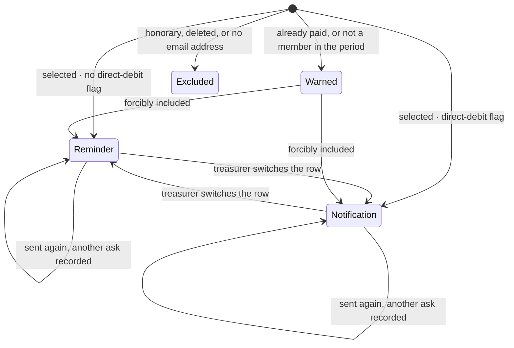
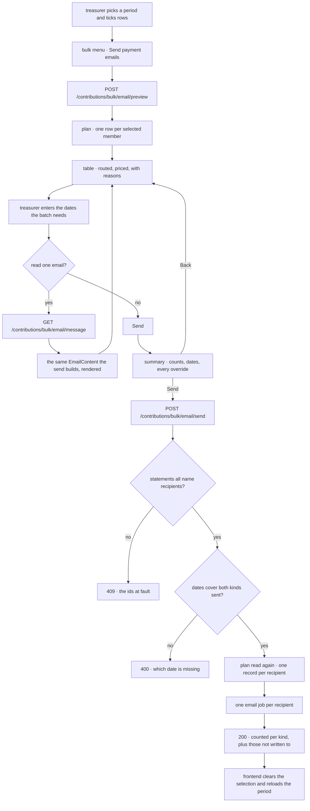
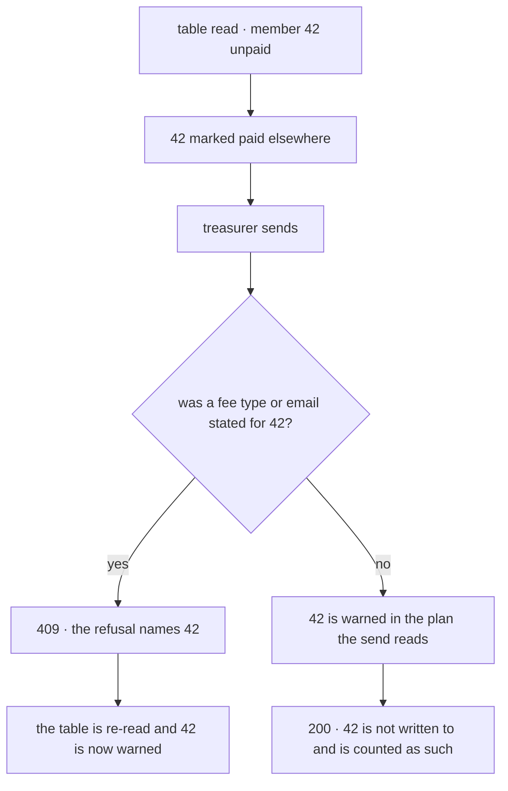

# Payment emails

## Scope

Covers a treasurer asking a selection of members for what they owe for one contribution
period: reading what each of them would be sent, reading one of the emails, and sending
them all from one confirmation.

Does not cover recording a contribution as paid — that is
[bulk contribution marking](../bulk-contribution-marking/README.md), the continuous half of
the same job — nor creating a contribution period, nor the single-member reminder sent from
a row, which quotes the period's fee options rather than one amount.

## Actors and entry points

A treasurer or board member, from the user manager at `/user-manager`. They select a
contribution period, tick rows with the row checkboxes, then pick **Send payment emails**
from the bulk actions menu. Without both a period and a selection the menu entry is
disabled: there is nothing to bill for, or nobody to bill.

Nothing else enters this flow. There is no scheduled job and no external caller.

## States

Not a stored state machine. A member is in one of these positions when the question is
asked of the data, and every position is visible in the table.

`Excluded` is not overridable. An honorary member owes nothing, a deleted account is nobody
to write to, and an address that is not on file cannot be written to; none of the three is a
judgement an operator can overrule, and a tick box on such a row would be a promise the tool
cannot keep.

`Warned` is a default, not a rule. A contribution recorded in error and a membership
backdated by hand are both real, so the operator can tick either row back in.

Which of `Reminder` and `Notification` a member starts in is the `incasso` flag on the
membership judged for them. That is a default too: a mandate that failed this morning is
chased by transfer, and no flag knows that yet.

## Invariants

Each of these is defended by a test named in the Testing section.

- An honorary member is never emailed, and cannot be forcibly included.
- A member with no email address is never emailed, and cannot be forcibly included.
- A deleted account is never emailed, and cannot be forcibly included.
- A member who has already paid is never emailed unless the operator says so explicitly.
- The table and the send never disagree about who is written to, which email they get, or
  what they owe. Both read one plan.
- No email quotes an amount without stating the reason that amount applies.
- No amount is ever typed. Every amount is the period's fee for a chosen fee type.
- A sent email never changes what it is recorded as having said. Both the amount and the fee
  type are stored, so editing next year's fee cannot rewrite last year's email.
- A member is never sent both emails by one send.
- A fee type, or a chosen email, naming a member the send does not write to is never
  silently ignored.
- An ask is never lost to a later one. A member can be asked as often as the treasurer
  needs, and each ask is its own record with its own moment.
- A member's last-sent date is never read from the other email, and is always the most
  recent of their asks of that kind.
- A member is never judged by the flag on a membership that has ended, where they hold one
  that has not.
- An email is never announced without the date it promises: a payment due date is required
  exactly when somebody is being asked to transfer, a debit date exactly when somebody is
  being told when the money moves.
- Reading an email writes no record and queues no send, and an email is never rendered for a
  member the send will not write to.
- Nothing is ever sent from the table alone. The summary stands between Send and the request,
  and backing out of it sends nothing.

## The journey

1. The treasurer picks a period, ticks the members, and opens the action.
2. The api plans it: one row per selected member, each partitioned by the direct-debit flag
   on the membership judged for them — their active one where they hold one — and priced by
   the fee type that applies.
3. The table shows each member's email, fee type and amount, the date they were last sent
   that same email, and a reason on every row that is warned about or not written to. Chips
   above it count each kind and those not written to, and follow the table as it changes.
4. The treasurer enters a payment due date, a debit date, or both — whichever the batch
   needs. The other is optional and says why.
5. They may switch a member onto the other email. The row is flagged, the counts move, and
   the Last sent column re-reads for the email now chosen.
6. They may change a member's fee type. The amount re-renders from the period without a
   round trip; there is no field for an amount.
7. They may read one member's email, built by the builder the send uses, for whichever email
   that row is currently set to.
8. Send does not send. It opens a summary: how many of each email, the dates they carry, and
   a line per override — forcibly included, switched, charged another fee type, already sent
   this before. Back returns to the table.
9. Confirming re-reads the plan, writes one record per recipient — a new one each time — and
   queues one email each.
10. The result reports each kind separately, and how many were not written to.

## Alternative orderings

The plan is read twice — once for the table and once by the send — so the data can move in
between.

A member who became warned without the treasurer having stated anything about them is not an
error: the send re-decides, and the answer is simply the newer one. A member the treasurer
*did* state something for is different — that statement now names somebody the send will not
write to, and applying the rest would leave the treasurer believing they had changed
something they had not.

The send runs in one transaction, so a change arriving after it begins is not a distinct
ordering.

## Credentials

This flow issues nothing. It is authorised by the caller's existing session and needs write
permission on both `ContributionReminder` and `IncassoNotification`, which the board role
carries. Both, on every endpoint, because one send writes both records. No token is minted,
transmitted out of band, or retired here.

The message endpoint renders an email carrying the recipient's name and address, so it is
gated identically to sending one.

## Endpoints

| | |
|---|---|
| Path | `POST /contributions/bulk/email/preview` |
| Authorisation | write on `ContributionReminder` **and** `IncassoNotification` |
| Request | `{contributionPeriodId, userIds[]}` — 1 to 1000 ids, all positive |
| Response 200 | `{contributionPeriodId, rows[]}` |
| Row | `{userId, name, memberType, memberSince, disposition, reason, defaultKind, feeType, amount, lastRemindedOn, lastNotifiedOn}` |

| | |
|---|---|
| Path | `POST /contributions/bulk/email/send` |
| Authorisation | as above |
| Request | `{contributionPeriodId, userIds[], forciblyIncludedUserIds[], kindOverrides, paymentDueDate, debitDate, feeTypeOverrides}` |
| Response 200 | `{remindersSent, incassoNotificationsSent, notWrittenTo}` |
| Response 400 | a date the batch needs was not given |
| Response 409 | `ProblemDetail` with `errors[]`, codes `NonRecipientFeeTypeUserIds` and `NonRecipientEmailKindUserIds`, `values` naming the ids |

| | |
|---|---|
| Path | `GET /contributions/bulk/email/message?kind=&contributionPeriodId=&userId=&date=&feeType=` |
| Authorisation | as above |
| Response 200 | `{kind, feeType, subject, html, recipientEmail, recipientName}` |
| Response 404 | the member could not be read, or this send writes nothing to them |

`kind` is `REMINDER` or `INCASSO_NOTIFICATION`; on the message request it is whichever the
row is currently set to, so a switched row previews what it will actually get. `feeType` is
`FULL_YEAR_FEE`, `HALF_YEAR_FEE` or `ALUMNI_FEE`, and is optional on the message request,
defaulting to the one that applies. `disposition` and `reason` come from the shared bulk
vocabulary; this flow sets `INCLUDED`, `WARNING` with `ALREADY_PAID` or
`NOT_MEMBER_IN_PERIOD`, and `EXCLUDED` with `HONORARY`, `DELETED` or `NO_EMAIL`.

Both dates are optional on the wire and required by what the batch turns out to send, which
is why the api rejects a missing one rather than the request shape doing it.

## Failure and recovery

**A statement names somebody the send no longer writes to.** 409 naming the ids. Nothing was
sent. The dialog re-reads the table and names the members at fault, and the treasurer sends
again.

**A member became warned between the read and the send.** They are not written to and are
counted among those that were not. No refusal, because nothing the treasurer stated was
about them.

**A date the batch needs is missing.** The form refuses before the request, and the api
rejects it with 400 naming which date. Reading an email is unavailable until that member's
own date is given, because it reaches the email.

**A date nobody needs is missing.** Nothing happens. The field says why it is empty, and the
send does not ask for it.

**The table cannot be read.** The dialog says so and shows no rows, so an empty table is
never mistaken for a selection with nobody left to ask.

**Sending twice, or five times.** Each send writes its own ask and queues its own email.
Re-sending is allowed as often as the treasurer needs — chasing is the job — so
`contribution_reminders` and `incasso_notifications` hold a row per ask rather than per
member and period, and the table reads the most recent of them.

**An email job fails.** The record was written before the send was queued, so a failed
delivery leaves a record and the job in the outbox rather than silently nothing.

**The operator changes their mind at the summary.** Back returns to the table with every
choice intact. Nothing was sent, because nothing is sent until the summary is confirmed.

**The client loses its state mid-action.** Nothing is held client-side but the two dates and
any switched rows or changed fee types. Reopening the dialog re-reads the table.

## Where the code lives

| Concern | File |
|---|---|
| Endpoints | `services/api/.../contribution/web/BulkContributionEmailController.kt` |
| Who is written to, with which email, and what they owe | `services/api/.../contribution/domain/ContributionEmailPlanner.kt` |
| The plan model | `services/api/.../contribution/domain/ContributionEmail.kt` |
| Sending, and refusing a stray statement | `services/api/.../contribution/domain/BulkContributionEmailUseCases.kt` |
| Fee type and amount from the period | `services/api/.../contribution/domain/FeeResolution.kt` |
| The contribution reminder | `services/api/.../contribution/domain/ContributionReminderEmailBuilder.kt` |
| The incasso notification | `services/api/.../contribution/domain/IncassoNotificationEmailBuilder.kt` |
| Rendering one for reading | `services/api/.../contribution/domain/ContributionEmailMessageService.kt` |
| The two records, one row per ask | `services/api/.../contribution/persistence/{ContributionReminder,IncassoNotification}.kt` |
| The dialog | `services/frontend/src/components/common/modals/bulk/ContributionEmailDialog.vue` |
| Routing, counting, and only what changed | `services/frontend/src/utils/contributionEmail.ts` |

## Testing

| Suite | Covers |
|---|---|
| `ContributionEmailPlannerTest` | The plan: routing, all three hard exclusions, both warnings, pricing, the judged membership, last-sent per kind |
| `BulkContributionEmailUseCasesTest` | The send: both kinds written and counted separately, switching, forcible include, the two refusals, the dates each kind needs |
| `FeeResolutionTest` | The cutoff boundary in both directions, and that the cutoff comes from the period |
| `ContributionReminderEmailBuilderTest`, `IncassoNotificationEmailBuilderTest` | The rendered bodies: the amount, the reason, the date, and that the notification asks for no transfer |
| `ContributionEmailMessageServiceTest` | Each kind renders its own email, a switched row reads the one it will get, an override is quoted, and the render goes through the shared renderer |
| `BulkContributionEmailControllerIT` | All three endpoints end to end, the 409 and 400 bodies, the authorisation, and that the send writes to exactly the members the table named |
| `ContributionEmail.test.ts`, `contributionEmail.test.ts` | The dialog: routing shown and switchable, live counts and re-pricing, last sent following the switch, the summary gate and its counts, only changed statements sent, a refusal reported rather than closed on |
| `user-manager-payment-emails.spec.ts` | The journey in a browser, against mocks |
| `payment-emails.feature` | The rules above, over HTTP against the running stack |

The table-and-send agreement is asserted directly: `BulkContributionEmailControllerIT` reads
the table, derives the included members from its rows, then asserts the send wrote to exactly
those. Scenario names in the feature file are mirrored by the integration test names, so the
correspondence can be checked by eye.
