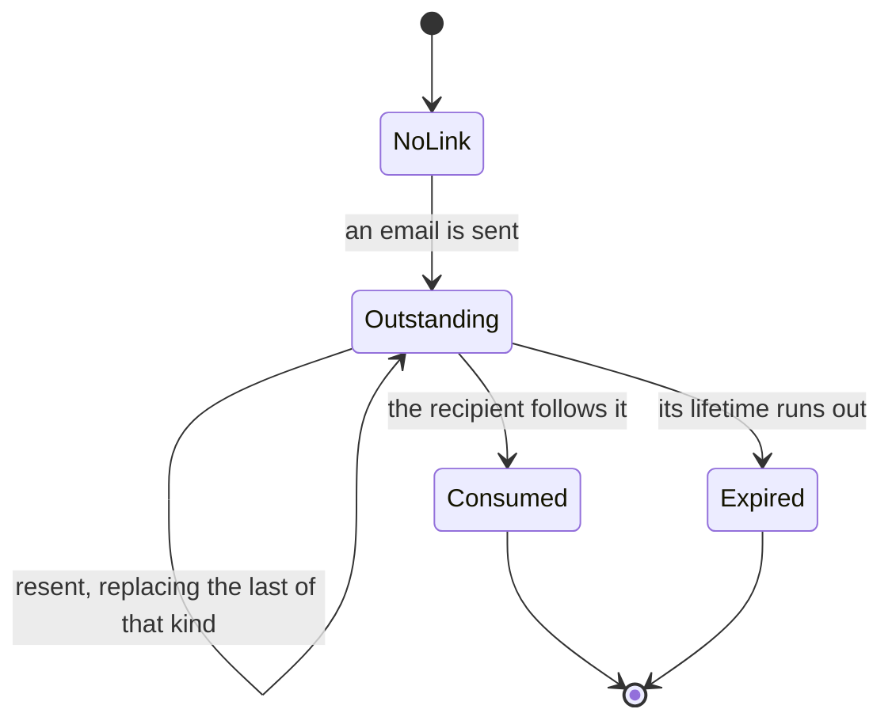
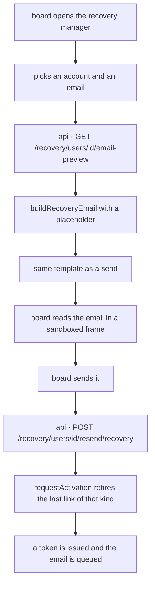

# Recovery emails

## 1. Scope

The three emails that let somebody into an account, how the board sends each one, and how
each can be read before it is sent.

Covers: previewing a recovery email, and resending one deliberately from the recovery
manager.

Does not cover: what happens when a recipient follows the link. That is
[account creation](../account-creation/README.md) for a user activation and
[signing in](../sign-in/README.md) for a password reset. It also does not cover the
self-service resend on the signup form, which needs no board member and is part of
account creation.

## 2. Actors and entry points

| Actor | Entry point |
|-------|-------------|
| Board member | `/recovery/manage` — the recovery manager, three panels by account state |
| Applicant | Not an actor here; they only receive what is sent |

## 3. States

A recovery email is not a thing with a lifecycle. What has state is the **link** it
carries, and the account it belongs to.

A link lives in `recovery_tokens`, one row per issue, keyed by `type` — the
`TokenPurpose`. `consumed_at` marks it used; `expires_at` marks when it stops working.
A preview creates no row.

| Account state | Emails the board can send |
|---------------|---------------------------|
| Not activated | user activation, member activation |
| Activated | password reset |
| Deleted | none; restoring sends nothing |

## 4. Invariants

- A preview **cannot** issue a token. No `recovery_tokens` row exists because one was read.
- A preview **cannot** send an email. No outbox row is written and nothing reaches the transport.
- A preview **cannot** show a working link. The link carries a placeholder, and the
  response names that placeholder so the reader is told.
- A `SIGNUP_CONTINUATION` token **cannot** appear in an email, previewed or sent.
- An account **cannot** hold two live links of the same kind. Issuing one retires the last.
- Issuing a link of one kind **cannot** retire a link of another kind.
- An already activated account **cannot** be issued an activation link.
- Somebody without permission to email an account **cannot** read its recovery emails.

## 5. The journey

1. The board member opens the recovery manager and finds the account.
2. Each email the row can send is paired with a preview of that same email.
3. Previewing renders through `buildRecoveryEmail` with `PREVIEW_TOKEN_PLACEHOLDER` and
   the same `EmailTemplateService.createEmail` a send uses.
4. The board member reads it. Nothing has happened to the account.
5. Sending names the purpose, so the email that arrives is the one that was read.
6. The previous link of that kind is retired and a new one issued.

## 6. Alternative orderings

Sending without previewing first is the ordinary case and is unchanged. Previewing
repeatedly, in any order, changes nothing — a preview has no effect to order against.
That is the whole point of it having none.

## 7. Credentials

| Token | Out of band | Held by | TTL | Use | Authorises | Retired by |
|-------|-------------|---------|-----|-----|------------|------------|
| `USER_ACTIVATION` | yes, emailed | recipient's inbox | 1 hour | once | activating an account that signed itself up | being used, expiring, or a replacement of the same kind |
| `MEMBER_ACTIVATION` | yes, emailed | recipient's inbox | 7 days | once | setting a username and password on a board-created account | being used, expiring, or a replacement of the same kind |
| `PASSWORD_RESET` | yes, emailed | recipient's inbox | 24 hours | once | setting a new password | being used or expiring |
| `PREVIEW_TOKEN_PLACEHOLDER` | no | nobody | none | none | **nothing** | not a token; a fixed string |

The placeholder is listed because it appears where a token would. It is
`PREVIEW-ONLY-NO-TOKEN-ISSUED`, is the same for every preview, and authorises nothing.

## 8. Endpoints

| Path | Method | Authorisation | Request | Response |
|------|--------|---------------|---------|----------|
| `/recovery/users/{userId}/email-preview` | GET | `hasPermission(#userId, 'User', 'email')` | `purpose` query, required | `RecoveryEmailPreviewResponse`; 400 for `SIGNUP_CONTINUATION` |
| `/recovery/users/{userId}/resend/recovery` | POST | `hasPermission(#userId, 'User', 'email')` | `purpose` query, optional | 204; 400 for a purpose that is not an activation |
| `/recovery/user/activate/resend/{username}` | POST | permit all | — | 204 |
| `/recovery/password/reset/{username}` | POST | permit all | — | 204 |

The preview is gated because the rendered email carries the recipient's name and address.
The two `permitAll` endpoints disclose nothing: they act on an address already on file and
answer the same way whether or not the account exists.

Omitting `purpose` on the resend keeps the older behaviour, where the kind is taken from
whichever activation link is outstanding and nothing is sent when none is.

## 9. Failure and recovery

| Situation | Result |
|-----------|--------|
| Account already activated | resend sends nothing, 204; there is nothing to activate |
| No link outstanding | a named purpose still sends; the automatic choice does not |
| Purpose is not an activation, on resend | 400 |
| Purpose is `SIGNUP_CONTINUATION`, on preview | 400 |
| User does not exist | 404 |
| Caller may not email the account | 403 |
| Preview cannot render | the dialog reports it and shows no email |

A preview needs no recovery path. It leaves nothing behind to recover from.

## 10. Where the code lives

| Concern | File |
|---------|------|
| Purpose to email | `services/api/.../domain/auth/application/email/RecoveryEmailBuilders.kt` |
| Preview render | `services/api/.../platform/integration/email/application/service/EmailSenderService.kt` |
| Issuing a named link | `services/api/.../domain/auth/application/UserActivationService.kt` |
| Endpoints | `services/api/.../domain/auth/web/RecoveryController.kt` |
| Preview shell | `services/frontend/src/components/common/modals/EmailPreviewDialog.vue` |
| Preview fetch | `services/frontend/src/composables/useRecoveryEmailPreview.ts` |
| Send and preview controls | `services/frontend/src/components/common/rows/RecoveryUserRow.vue` |

## 11. Testing

`services/system-tests/src/test/resources/features/recovery-emails.feature` carries the
scenarios; `RecoveryEmailSteps.kt` drives them over HTTP and reads `recovery_tokens`
directly, so an assertion about what was issued is about the database and not the
response.

| Invariant | Scenario |
|-----------|----------|
| A preview issues no token | Previewing issues no link |
| A preview sends nothing | Previewing sends nothing |
| A preview shows no working link | Reading the activation email before sending it |
| `SIGNUP_CONTINUATION` is never emailed | A signup continuation token is never rendered into an email |
| The kind sent is the kind asked for | The kind asked for is the kind sent, not the kind outstanding |
| One live link per kind | Resending retires the link it replaces |
| Kinds are independent | Resending leaves a link of the other kind alone |
| An active account gets no activation | An account that is already active is sent no activation |
| A purpose that is not an activation is refused | Resending a password reset through the activation endpoint is refused |
| Permission is required | Previewing somebody else's recovery email is forbidden |

Signing up already issues a user activation link and sends its email, so the scenarios
count from what a fresh account arrives with rather than from zero.

`RecoveryManagerPageSystemTest` drives the same ground through a browser: the preview
opens, states that its link is inert, and leaves the account's links and mail untouched.

Unit coverage sits alongside: `RecoveryEmailSelectorTest` on the purpose-to-email
mapping, `RecoveryEmailPreviewTest` on the absences a preview relies on,
`UserActivationServiceTest` on TTLs and retirement, and `EmailPreviewDialog.test.ts`,
`useRecoveryEmailPreview.test.ts` and `RecoveryUserRow.test.ts` on the frontend.
