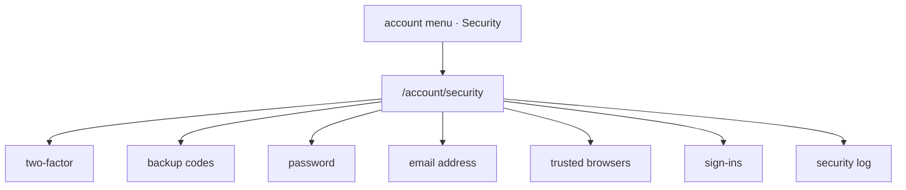

# Security page

`/account/security` is where somebody manages how they sign in: two-factor, backup
codes, their password, their email address, their trusted browsers and their sign-ins,
and where they read their own security log.

## 1. Scope

Covers the page, what each section does and which of them ask for a step-up and the
account menu that leads to it.

Does not cover:

- **[Two-factor](../two-factor/README.md).** What setting up, replacing and turning off
  do. The page is where they start.
- **[Account lock](../account-lock/README.md).** What an email change sends and what a
  lock link does.
- **[Signing in](../sign-in/README.md).** What a sign-in is and what ends one.
- **Profile and game handles.** `/account` holds the profile form; `/account/games`
  holds game handles. Neither asks for a step-up.

## 2. Actors and entry points

| Actor | Entry point |
|-------|-------------|
| Anybody signed in | the account menu: Account, Security, Games, Address |
| Anybody signed in | `/account/security` directly |
| Somebody holding a dormant role | the forced set-up section of the page, where the router sends them |

The menu shows Address only when the person has one.

## 3. States

The page has no state of its own. Each section reads the person's:

| Section | Reads |
|---------|-------|
| Two-factor | off, setting up or on |
| Backup codes | how many are left |
| Password | nothing; a form |
| Email address | the current address, and any change pending |
| Trusted browsers | each one: browser family and operating system, when trusted, when last used |
| Sign-ins | each one: browser family and operating system, when it began, when last used, which is this browser |
| Security log | the person's own security events, newest first |

Security events are rows in `security_events`: the person, the actor, the kind, a note,
when and the browser family and operating system. They are kept twelve months and then
purged by a daily job.

## 4. Invariants

- Changing the password **cannot** happen without the current password, nor without a
  step-up where two-factor is on.
- Changing the password **cannot** leave another sign-in or any trusted browser in place.
  The sign-in it was changed from carries on.
- Changing the email address, turning two-factor off, replacing it and regenerating
  backup codes **cannot** happen without a step-up where two-factor is on.
- Ending a sign-in or revoking a trusted browser **cannot** touch anybody else's.
- Sign out everywhere **cannot** leave a sign-in or a trusted browser in place, this one
  included.
- The security log **cannot** show another person's events, nor an event older than
  twelve months.
- The page **cannot** show a secret, a backup code already shown or a token.

## 5. The journey

1. **Two-factor.** Set up, replace or turn off, as described in
   [two-factor](../two-factor/README.md). Somebody holding a granted role sees replace
   and not turn off.
2. **Backup codes.** How many are left, and regenerate. With three or fewer left the
   section asks for new ones.
3. **Password.** The current password and the new one, and a step-up where two-factor is
   on. Every other sign-in ends and every trusted browser is forgotten. Forgetting the
   password is handled on `/login`, not here.
4. **Email address.** A step-up and the new address; see
   [account lock](../account-lock/README.md) for what is sent.
5. **Trusted browsers.** Revoke one or all.
6. **Sign-ins.** End one, or sign out everywhere. Signing out everywhere ends this
   sign-in too and sends the browser to `/login`.
7. **Security log.** What changed, when, from which browser and who did it: the person,
   an admin or the operator.

Each change sends a security notification.

## 6. Alternative orderings

Ending this browser's own sign-in from the list is the same as logging out.

A step-up given for one section covers the others for its ten minutes, on this sign-in
only.

## 7. Credentials

The page issues no credential of its own. It asks for a step-up, described in
[two-factor](../two-factor/README.md), and ends sign-ins and trusted browsers, described
in [signing in](../sign-in/README.md).

## 8. Endpoints

| Path | Method | Authorisation | Request | Response |
|------|--------|---------------|---------|----------|
| `/users/me/password` | PUT | signed in, step-up where two-factor is on | current password, new password | 204 |
| `/users/me/trusted-browsers` | GET | signed in | — | the list |
| `/users/me/trusted-browsers/{id}` | DELETE | signed in, own | — | 204 |
| `/users/me/trusted-browsers` | DELETE | signed in | — | 204 |
| `/users/me/sign-ins` | GET | signed in | — | the list, this one marked |
| `/users/me/sign-ins/{id}` | DELETE | signed in, own | — | 204 |
| `/users/me/sign-ins` | DELETE | signed in | — | 204; sign out everywhere |
| `/users/me/security-events` | GET | signed in | page | the person's events |
| `/users/{userId}/security-events` | GET | admin | page | that person's events, for the user manager |

The two-factor, backup-code and email-change endpoints are listed in their own flows.

## 9. Failure and recovery

| Situation | Result |
|-----------|--------|
| Wrong current password | refused, 400; nothing changes |
| Step-up expired | asked again |
| Sign-in or trusted browser already gone | 404; the list is refreshed |
| This sign-in ended from another browser | the next request is refused and the page offers sign-in |

## 10. Where the code lives

| Concern | Location |
|---------|----------|
| Password, sign-ins, trusted browsers and the log | `services/api/.../security/` (new) and `services/api/.../twofactor/` (new) |
| Retention job | `services/api/.../security/` (new), on `JobQueue` |
| The page | `services/frontend/src/pages/account/security/` (new) |
| Games page | `services/frontend/src/pages/account/Games.vue` (new), wrapping `domains/esports/components/GameHandles.vue` |
| Account menu | `services/frontend/src/components/common/nav.ts` — `accountFor` |
| Routes | `services/frontend/src/plugins/router.ts` |

## 11. Testing

| Invariant | Suite |
|-----------|-------|
| Password change needs the current password and a step-up, and ends other sign-ins | api integration |
| Ending and revoking touch only one's own | api integration |
| Sign out everywhere leaves nothing | api integration |
| The log shows one's own events and nothing past twelve months | api integration, with injected time per [testing ADR-008](../../adr/testing/ADR-008-time-is-injected-where-a-rule-reads-it.md) |
| The page as a user drives it | browser system test under `tests/system/.../frontend/account/` (new), and `security-page.feature` (new) |
| Games page and account menu | browser system test `AccountPageSystemTest.kt`, frontend unit tests for `nav.ts` |
| Each section's rendering and step-up prompt | frontend unit and e2e tests |

## Related documentation

- [Two-factor](../two-factor/README.md)
- [Account lock](../account-lock/README.md)
- [Signing in](../sign-in/README.md)
