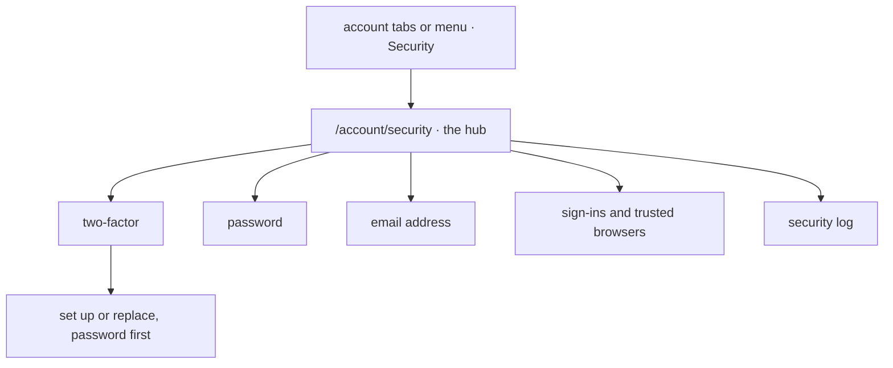

# Security page

`/account/security` is where somebody manages how they sign in. It is a hub: where the
account stands, then one row per task, each opening a page of its own for two-factor and
backup codes, the password, the email address, sign-ins with trusted browsers, and the
security log.

## 1. Scope

Covers the hub, what each task page does and which of them ask for a step-up, and the
account tabs and menu that lead to it.

Does not cover:

- **[Two-factor](../two-factor/README.md).** What setting up, replacing and turning off
  do. The page is where they start.
- **[Account lock](../account-lock/README.md).** What an email change sends and what a
  lock link does.
- **[Signing in](../sign-in/README.md).** What a sign-in is and what ends one.
- **Profile and game handles.** `/account` holds the profile form; `/account/games`
  holds game handles. Neither asks for a step-up.

## 2. Actors and entry points

| Actor | Entry point |
|-------|-------------|
| Anybody signed in | the account menu, or the tabs every account page shares: Account, Security, Games, Address |
| Anybody signed in | `/account/security` directly, or a task page under it |
| Somebody holding a dormant role | `/account/set-up-two-factor`, where the router sends them; see [two-factor](../two-factor/README.md) |

The menu and the tabs show Address only when the person has one.

## 3. States

The pages have no state of their own. Each reads the person's:

| Page | Path | Reads |
|------|------|-------|
| Hub | `/account/security` | two-factor on or off and the codes left, the sign-ins and trusted browsers, the address and any move pending, the newest entry of the log |
| Two-factor | `/account/security/two-factor` | on since when, how many backup codes are left, whether it may be turned off |
| Set up | `/account/security/two-factor/set-up` | nothing; four steps, the password first (`?replace=1` replaces an app) |
| Password | `/account/security/password` | the address a reset link would go to |
| Email address | `/account/security/email` | the current address, and any change pending |
| Where you are signed in | `/account/security/sign-ins` | each sign-in and each trusted browser: browser family and operating system, when it began or was trusted, when last used, which is this browser |
| Security log | `/account/security/log` | the person's own security events, newest first, a page at a time and grouped by day |

Security events are rows in `security_events`: the person, the actor, the kind, a note,
when and the browser family and operating system. They are kept twelve months and then
purged by a daily job.

## 4. Invariants

- Changing the password **cannot** happen without the current password, nor without a
  step-up where two-factor is on.
- Changing the password **cannot** leave another sign-in or any trusted browser in place.
  The sign-in it was changed from carries on.
- Changing the email address, turning two-factor off, replacing it and regenerating
  backup codes **cannot** happen without a step-up where two-factor is on.
- Ending a sign-in or revoking a trusted browser **cannot** touch anybody else's.
- Sign out everywhere **cannot** leave a sign-in or a trusted browser in place, this one
  included.
- The security log **cannot** show another person's events, nor an event older than
  twelve months.
- The page **cannot** show a secret, a backup code already shown or a token.

## 5. The journey

1. **Two-factor.** Without it, the row opens the set-up, which asks for the password
   before the QR code. With it, the row opens the two-factor page: new backup codes,
   replace the app, and turning off apart as a danger strip. Somebody holding a granted
   role sees replace and not turn off, and a line saying why. See
   [two-factor](../two-factor/README.md).
2. **Backup codes.** How many are left, and regenerate, on the two-factor page. With three
   or fewer left the hub and the two-factor page ask for new ones, and so does a banner on
   every other page until put off; the banner opens the two-factor page.
3. **Password.** The current password and the new one, and a step-up where two-factor is
   on. Every other sign-in ends and every trusted browser is forgotten. Forgetting the
   password is handled on `/login`, not here.
4. **Email address.** A step-up and the new address; see
   [account lock](../account-lock/README.md) for what is sent.
5. **Sign-ins and trusted browsers.** One page, each heading counted. End one sign-in,
   sign out everywhere else or sign out everywhere; forget one trusted browser or all.
   Signing out everywhere ends this sign-in too and sends the browser to `/login`.
6. **Security log.** Every sign-in and every change to the account's security, including
   a role change, with when, from which browser and who did it: the person, an admin or
   the operator. Grouped by day, a page at a time.

Each change sends a security notification.

## 6. Alternative orderings

Ending this browser's own sign-in from the list is the same as logging out.

A step-up given for one section covers the others for its ten minutes, on this sign-in
only.

## 7. Credentials

The page issues no credential of its own. It asks for a step-up, described in
[two-factor](../two-factor/README.md), and ends sign-ins and trusted browsers, described
in [signing in](../sign-in/README.md).

## 8. Endpoints

| Path | Method | Authorisation | Request | Response |
|------|--------|---------------|---------|----------|
| `/users/me/email` | GET | signed in | — | the address, and the one a pending move goes to |
| `/users/me/password` | PUT | signed in, step-up where two-factor is on | current password, new password | 204 |
| `/users/me/trusted-browsers` | GET | signed in | — | the list |
| `/users/me/trusted-browsers/{id}` | DELETE | signed in, own | — | 204 |
| `/users/me/trusted-browsers` | DELETE | signed in | — | 204 |
| `/users/me/sign-ins` | GET | signed in | — | the list, this one marked |
| `/users/me/sign-ins/{id}` | DELETE | signed in, own | — | 204 |
| `/users/me/sign-ins/others` | DELETE | signed in | — | 204; every sign-in but this one ends |
| `/users/me/sign-ins` | DELETE | signed in | — | 204; sign out everywhere |
| `/users/me/security-events` | GET | signed in | page | the person's events |
| `/users/{userId}/security-events` | GET | admin | page | that person's events, for the user manager |
| `/users/{userId}/account-security` | GET | admin | — | two-factor on, awaiting re-enrolment, locked |

The two-factor, backup-code and email-change endpoints are listed in their own flows.

## 9. Failure and recovery

| Situation | Result |
|-----------|--------|
| Wrong current password | refused, 400; nothing changes |
| Step-up expired | asked again |
| Sign-in or trusted browser already gone | 404; the list is refreshed |
| This sign-in ended from another browser | the next request is refused and the page offers sign-in |

## 10. Where the code lives

| Concern | Location |
|---------|----------|
| Password, sign-ins, trusted browsers and the log | `services/api/src/main/kotlin/net/blueshell/api/auth/domain/AccountSecurity.kt`, endpoints in `auth/web/AccountSecurityController.kt` |
| Retention | `services/api/src/main/kotlin/net/blueshell/api/auth/domain/SecurityEvents.kt`, a daily purge |
| The hub | `services/frontend/src/pages/login/Security.vue` |
| The task pages | `services/frontend/src/pages/login/security/` |
| The account header and tabs | `services/frontend/src/components/common/AccountFrame.vue` |
| Games page | `services/frontend/src/pages/login/AccountGames.vue`, wrapping `domains/esports/components/GameHandles.vue` |

## 11. Testing

| Invariant | Covered by |
|-----------|------------|
| Changing the password asks for the current one, and a step-up with two-factor | `SecurityPageIT` |
| Sign-ins are listed with this one marked, and end one at a time or all at once | `SecurityPageIT` |
| Trusted browsers are listed and forgotten | `SecurityPageIT` |
| The address reads with a move still waiting | `SecurityPageIT` |
| The hub opens a page per task; each task page asks for a step-up and runs the change again once proved | frontend unit `Security.test.ts` and `pages/login/security/*.test.ts` |
| The pages as a member drives them | `TwoFactorSystemTest`, `AccountSecuritySystemTest` and the frontend e2e `two-factor.spec.ts` and `account-pages.spec.ts` |

## Related documentation

- [Two-factor](../two-factor/README.md)
- [Account lock](../account-lock/README.md)
- [Signing in](../sign-in/README.md)
