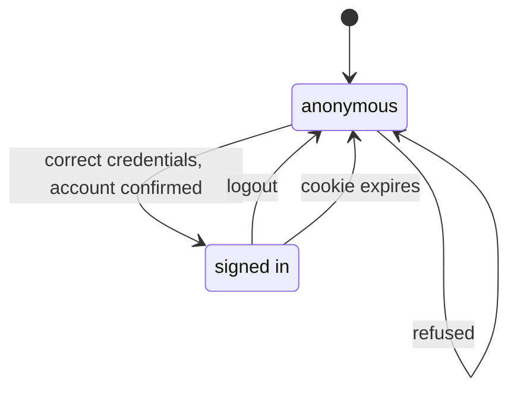
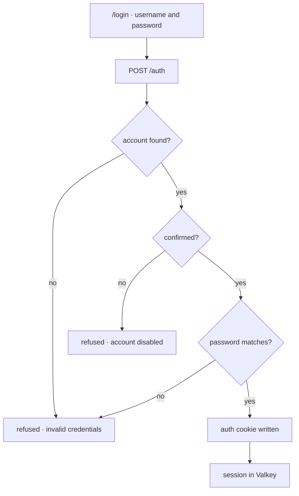

# Signing In

Signing in exchanges a username and a password for an auth cookie. It is the
gate every authenticated surface sits behind, so what it refuses, and how much it
says while refusing, is the whole of its behaviour.

## Scope

Covers `POST /auth`, the conditions under which it issues a session, and what
happens to that session on logout.

Does **not** cover:

- **[Account creation](../account-creation/README.md).** What has to happen before
  signing in is possible at all.
- **[Membership signup](../membership-signup/README.md).** Signing in is not
  joining; a signed-in person may or may not be a member.
- **Password reset.** The way back in when the password is the thing that is lost.
- **OIDC.** `/api` also issues OIDC tokens for Headlamp and Vault, which is a
  separate credential flow with its own clients and consent.

## Actors and entry points

| Actor | Entry point | Outcome |
|-------|-------------|---------|
| Anybody with a confirmed account | `/login` | An auth cookie and a session |
| Anybody at all | `POST /auth` | A cookie, or a refusal |

## States

## Invariants

1. **An unconfirmed account cannot sign in.** The account exists and the password
   is right, and it is still refused, because the address behind it was never
   proven reachable.
2. **Being signed in implies a confirmed address.** This is the property the rest
   of the system leans on: no surface behind the gate has to re-check it, and the
   signup flows use it to decide whether an applicant needs a confirmation step
   at all.
3. **Signing in grants nothing beyond the account's own roles.** It is not
   membership, and it does not imply one.
4. **A wrong password and an account that does not exist are refused
   identically.** Both raise `BadCredentialsException` and answer the same way,
   so the form cannot be used to test whether an address is registered.
5. **Logout ends the session server-side.** The JWT is revoked by its `jti` and
   the Valkey-backed session is invalidated, so the cookie expiring is not the
   only thing standing between a stolen cookie and an account.

## The journey

The order matters: the confirmation check sits before the password check, so an
unconfirmed account is refused as disabled whether or not the password was right.

## What the refusal reveals

`UserAuthenticationProvider` raises two different failures, and they are
deliberately not equally silent:

| Situation | Failure | What a caller learns |
|-----------|---------|----------------------|
| No such account | `BadCredentialsException` | Nothing |
| Wrong password | `BadCredentialsException` | Nothing |
| Unconfirmed account | `DisabledException` | That the account exists and is unconfirmed |

The first two are indistinguishable, which is what keeps the form from answering
"is this address registered". The third is distinguishable on purpose: somebody
who registered and never confirmed needs to be told to go and confirm, and they
already know the account exists because they created it.

## Credentials

| | Auth cookie | Server-side session |
|---|---|---|
| Purpose | Carry the signed-in identity | Hold session state |
| Form | JWT in an http-only cookie, name from `security.auth-cookie.name` | Valkey entry keyed by the `SESSION` cookie |
| Issued by | `POST /auth` | The servlet container on first use |
| Retired by | Logout revoking the `jti`, or expiry | Logout invalidating it, or expiry |

## Endpoints

| Method | Path | Authorisation | Notes |
|--------|------|---------------|-------|
| `POST` | `/auth` | `@PermitAll` | Body `JwtRequest`. Writes the auth cookie and returns `AuthenticationResponse`. 10/min per client. |
| `POST` | `/auth/logout` | `@PermitAll` | Revokes the JWT by `jti`, invalidates the session, clears the cookie. `204`. |

Rate limits live in `PublicAuthRateLimitFilter`, keyed per client.

## Failure and recovery

**Unconfirmed.** Ask for the confirmation email again from
[account creation](../account-creation/README.md), then sign in.

**Forgotten password.** The password-reset path, which does not require signing
in.

**Rate limited.** 10 attempts a minute per client; the limiter answers before the
credentials are examined.

## Where the code lives

**API**

| Concern | Location |
|---------|----------|
| The endpoint | `domain/auth/web/AuthenticationController.kt` |
| Credential and confirmation checks | `infrastructure/security/UserAuthenticationProvider.kt` |
| Cookie writing and clearing | `infrastructure/security/AuthTokenCookieService.kt` |
| JWT revocation | `infrastructure/security/JwtRevocationService.kt` |
| Rate limits | `infrastructure/security/PublicAuthRateLimitFilter.kt` |

**Frontend**

| Concern | Location |
|---------|----------|
| The page | `src/pages/login/Login.vue` |
| Session state | `src/plugins/store.ts` |
| Cookie and CSRF handling | `src/services/api/blueshell.runtime.ts` |

## Testing

| Suite | Location | Covers |
|-------|----------|--------|
| Acceptance features | [`sign-in.feature`](../../../services/system-tests/src/test/resources/features/sign-in.feature) | Who gets in, who does not, and what the refusal gives away |
| Browser system tests | `services/system-tests/.../frontend/login/` | The page as a user drives it |
| Frontend unit | `services/frontend/tests/unit/pages/login/Login.test.ts` | Form behaviour and error rendering |

## Related documentation

- [Account creation](../account-creation/README.md)
- [Membership signup](../membership-signup/README.md)
