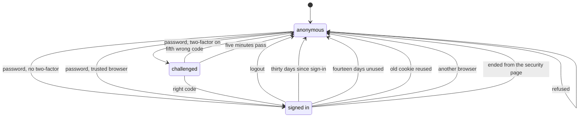
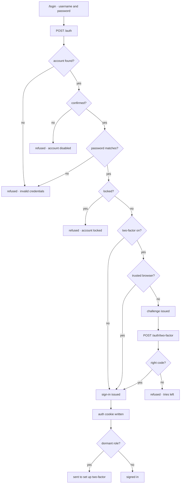

# Signing In

Signing in exchanges a username, a password and, where the account has one, a second
factor for a **sign-in**: a record on the server that one browser holds a cookie for.
It is the gate every authenticated surface sits behind, so what it refuses, how much it
says while refusing and how long what it hands out stays good is the whole of its
behaviour.

## Scope

Covers `POST /auth`, the two-factor challenge that follows it, the sign-in it issues,
how that sign-in is carried, rotated and ended and how the OIDC and forward-auth paths
read it.

Does **not** cover:

- **[Account creation](../account-creation/README.md).** What has to happen before
  signing in is possible at all.
- **[Membership signup](../membership-signup/README.md).** Signing in is not
  joining; a signed-in person may or may not be a member.
- **[Two-factor](../two-factor/README.md).** Setting up, replacing and resetting the
  second factor. This doc only covers asking for it.
- **[Account lock](../account-lock/README.md).** How an account becomes locked and is
  unlocked. This doc only covers refusing it.
- **[Security page](../security-page/README.md).** Where a person sees and ends their
  own sign-ins.
- **Password reset.** The way back in when the password is the thing that is lost.

## Actors and entry points

| Actor | Entry point | Outcome |
|-------|-------------|---------|
| Anybody with a confirmed account | `/login` | A sign-in, or a two-factor challenge first |
| Anybody at all | `POST /auth` | A sign-in, a challenge or a refusal |
| Somebody holding a challenge | `POST /auth/two-factor` | A sign-in, or a refusal |
| An admin signing in to Vault or Headlamp | `/oauth2/authorize` | An authorization code, after a fresh code |
| Traefik, for an admin tool | `GET /oauth2/forward-auth` | Allowed or refused, read off the sign-in |

## States

**Challenged** is a record on the server, keyed by an opaque value in a short-lived
http-only cookie. It holds who passed the password, when and how many codes have been
tried. It grants nothing: no endpoint but `POST /auth/two-factor` reads it.

**Signed in** is the sign-in record in Valkey. It holds the person, when the sign-in
began and was last used, the browser family and operating system it began in, the
current and previous token ids, when a second factor was last given and the person's
security stamp at the time. The auth cookie is a view of that record and is refused the
moment the record is gone.

A signed-in person's roles in force are their roles less any **dormant role**: a
granted role held without two-factor set up. Somebody in that position is signed in
with member powers only and is sent to set up two-factor before anything else.

## Invariants

1. **An unconfirmed account cannot sign in.** The account exists and the password
   is right, and it is still refused, because the address behind it was never
   proven reachable.
2. **Being signed in implies a confirmed address.** No surface behind the gate has
   to re-check it.
3. **A wrong password and an account that does not exist are refused
   identically.** Both raise `BadCredentialsException` and answer the same way,
   so the form cannot be used to test whether an address is registered.
4. **A locked account cannot sign in, and only the right password learns it is
   locked.** The lock is checked after the password, so a guesser is told
   "invalid credentials" like anybody else.
5. **An account with two-factor cannot be signed in to with the password alone,**
   except from a trusted browser of its own. A password reset changes nothing here,
   and an account whose two-factor was reset is signed in only through its
   re-enrolment link.
6. **A challenge cannot be used as a sign-in.** It is not an auth cookie, is refused
   by every endpoint but the code step, and dies after one right code, five wrong
   ones or five minutes.
7. **A code cannot be used twice.** An authenticator code whose time step has
   already been accepted for the account is refused, and a backup code is spent
   the first time it is used.
8. **A dormant role grants nothing.** Not at the api, not at forward-auth and not
   through OIDC.
9. **A sign-in cannot outlive thirty days,** however much it is used, nor fourteen
   days without use.
10. **A sign-in cannot move browsers.** A request whose browser family or operating
    system differs from the one the sign-in began in ends it.
11. **An old cookie cannot come back.** A token id that is neither the current one
    nor the previous one within its grace ends the sign-in and sends a security
    notification.
12. **The OIDC path cannot skip the code.** Every authorization request from an
    account with two-factor asks for a fresh one, trusted browser or not.
13. **An OIDC refresh token cannot outlive the sign-in behind it.** It renews
    without a code only while that sign-in lives.
14. **Logout ends the sign-in server-side.** The record is deleted, so no copy of
    the cookie works afterwards on any replica.

## The journey

1. The form posts the username and password to `POST /auth`.
2. The confirmation check runs before the password check, so an unconfirmed account
   is refused as disabled whether or not the password was right.
3. The lock check runs after the password check, so only the owner of the password
   learns the account is locked.
4. An account without two-factor, or one presenting a trusted browser cookie of its
   own, gets its sign-in straight away. A trusted browser cookie is rotated each time
   it is used.
5. Any other account with two-factor gets a challenge. The form asks for a code from
   the authenticator app, or a backup code, and may tick "trust this browser".
6. A right code turns the challenge into a sign-in. A backup code is spent and a
   security notification says so.
7. A sign-in from a browser family and operating system the person has not signed in
   from before sends a security notification.
8. A person holding a dormant role is signed in and sent to set up two-factor; the
   router keeps them there until they have.

## Alternative orderings

A challenge and a sign-in for the same account can be open in two browsers at once:
each browser holds its own. A right code in one does not touch the other.

A code arriving after its challenge has expired is refused as an expired challenge,
never checked, so a late right code is not counted as a wrong one either.

## What the refusal reveals

| Situation | Failure | What a caller learns |
|-----------|---------|----------------------|
| No such account | `BadCredentialsException` | Nothing |
| Wrong password | `BadCredentialsException` | Nothing |
| Unconfirmed account | `DisabledException` | That the account exists and is unconfirmed |
| Locked account, right password | `LockedException` | That their account is locked, and who to contact |
| Two-factor on, right password | a challenge | That the password was right |
| Awaiting re-enrolment, right password | a refusal | To use the re-enrolment link in their email |
| Wrong code | a refusal with tries left | Nothing new |

The last two tell the caller the password was right. That is unavoidable for any second
factor, and it is why a run of wrong codes sends the owner a security notification:
somebody else knows their password.

## Credentials

| | Challenge | Sign-in | Auth cookie | Trusted browser |
|---|---|---|---|---|
| Purpose | Carry a passed password to the code step | The signed-in state itself | Carry the sign-in on each request | Skip the code at sign-in |
| Form | Record on the server, opaque key in an http-only cookie | Valkey record keyed by a sign-in id | JWT naming the sign-in id and a token id, http-only, name from `security.auth-cookie.name` | Selector and verifier in an http-only cookie; verifier hashed in the database |
| Out of band | no | no | no | no |
| Issued by | `POST /auth` | `POST /auth`, `POST /auth/two-factor` | The same, and every rotation | `POST /auth/two-factor` with "trust this browser" |
| TTL | five minutes | thirty days from sign-in, fourteen days unused | five minutes, then rotated | thirty days from being trusted, however often used |
| Use | five tries, one success | many | many, until rotated | once per sign-in, rotated on use |
| Authorises | `POST /auth/two-factor` only | nothing by itself; read through the cookie | everything the person's roles in force allow | skipping the code on `POST /auth` only |
| Retired by | a right code, the fifth wrong one, expiry | logout, its lifetime, reuse, another browser, being ended, sign out everywhere, a lock, a two-factor reset | rotation, then sixty seconds | its lifetime, being revoked, a password change or reset, a two-factor change or reset, a lock |

**Rotation.** A request made with an auth cookie older than five minutes is answered
with a new one naming a new token id. The previous token id stays good for sixty
seconds so that calls already in flight, and other tabs, are not refused. Forward-auth
never rotates: Traefik keeps the Set-Cookie of its answer to itself, so a rotation there
would leave the browser holding a retired id.

**Reuse.** A token id that is neither current nor previous within its grace ends the
whole sign-in, for whoever holds it, and sends a security notification. Somebody holding
a copy of the cookie and the owner are signed out of that browser together.

**Browser binding.** The sign-in records the browser family and operating system it
began in, not their versions, so an update does not sign anybody out. A request from a
different family or system ends the sign-in and sends a security notification. This is
a speed bump: the value is copied as easily as the cookie is.

**Security stamp.** Every sign-in records the person's security stamp. Changing the
stamp — sign out everywhere, a password change or reset, turning two-factor on, a
two-factor reset, a lock — ends every sign-in that carries the old one. Where the
person made the change themselves, the sign-in they made it from takes the new stamp
and carries on.

**The token is never readable by the page.** `POST /auth` answers who signed in and
their roles in force, never the token. The frontend sends the cookie; a bearer header is
not accepted for a browser sign-in.

## OIDC and forward-auth

`/oauth2/authorize` for Vault and Headlamp reads the same sign-in. For an account with
two-factor it asks for a code given in this sign-in within the step-up window of ten
minutes, and a trusted browser does not count: without one, the browser is sent to
`/login?stepUp=1&redirect=…`, which takes the code and goes back to the authorization.
The ID and access tokens name the methods used in `amr`: `pwd`, and `otp` once a code
has been given.

A Vault or Headlamp refresh token renews without a code, but only while the site sign-in
it was issued under lives. The end of that sign-in, a lock, a two-factor reset and
signing out everywhere retire every refresh token issued under it, so the next renewal
is refused and the tool sends the admin back through `/oauth2/authorize`.

`GET /oauth2/forward-auth` reads the same sign-in and the same roles in force, so a
dormant admin role opens neither Traefik, Vault nor Headlamp, and a dormant board role
does not open Stalwart.

## Endpoints

| Method | Path | Authorisation | Notes |
|--------|------|---------------|-------|
| `POST` | `/auth` | `@PermitAll` | Body `JwtRequest`. Answers a sign-in (cookie written, `AuthenticationResponse` without a token) or a challenge (challenge cookie written). 10/min per client. |
| `POST` | `/auth/two-factor` | the challenge cookie | Body: a code or a backup code, and whether to trust this browser. Answers a sign-in or a refusal with tries left. 10/min per client; 5 tries per challenge; 10 wrong codes per 15 min per account. |
| `POST` | `/auth/logout` | `@PermitAll` | Deletes the sign-in, clears the cookie. `204`. |
| `GET` | `/oauth2/authorize` | a sign-in, admin | Asks for a fresh code first when the account has two-factor. |
| `GET` | `/oauth2/forward-auth` | a sign-in | Reads roles in force. |

Rate limits per client live in `PublicAuthRateLimitFilter`. The per-account code limit
lives in Valkey, so every replica counts the same failures.

## Failure and recovery

**Unconfirmed.** Ask for the confirmation email again from
[account creation](../account-creation/README.md), then sign in.

**Forgotten password.** The password-reset path, which does not require signing in.
Two-factor stays on through it.

**Lost authenticator app.** Sign in with a backup code. With neither, an admin performs
a [two-factor reset](../two-factor/README.md).

**Locked.** The refusal names who to contact; an admin unlocks. See
[account lock](../account-lock/README.md).

**Challenge expired or used up.** Enter the password again; a new challenge is issued.

**Code limit reached.** Codes are refused for the account until fifteen minutes after
the first of the ten failures. The owner has been told by a security notification.

**Signed out by reuse or another browser.** Sign in again. The security notification
carries a lock link in case it was not them.

**Rate limited.** 10 password attempts a minute per client; the limiter answers before
the credentials are examined.

## Where the code lives

**API** — under `services/api/src/main/kotlin/net/blueshell/api/`

| Concern | Location |
|---------|----------|
| The endpoints | `auth/web/AuthenticationController.kt` |
| Password, challenge, trusted browser and re-enrolment | `auth/domain/AuthenticationService.kt` |
| Credential, confirmation and lock checks | `security/UserAuthenticationProvider.kt` |
| The challenge and the per-account code count | `auth/domain/twofactor/Challenges.kt` |
| Codes and backup codes | `auth/domain/twofactor/TwoFactor.kt`, `Totp.kt`, `BackupCodes.kt` |
| Trusted browsers | `auth/domain/twofactor/TrustedBrowsers.kt` |
| The sign-in record, rotation, reuse and browser binding | `security/SignIns.kt`, stored by `security/ValkeySignInStore.kt` |
| Reading the cookie on every request | `security/JwtAuthFilter.kt` |
| Cookie writing and clearing | `security/AuthTokenCookieService.kt` |
| Roles in force | `user/persistence/User.kt` (`rolesInForce`), read by `shared/security/UserPrincipalMapper.kt` |
| Rate limits per client | `security/PublicAuthRateLimitFilter.kt` |
| OIDC and forward-auth | `oidc/domain/AuthorizationServerConfig.kt`, `oidc/domain/OidcTokenCustomizer.kt`, `oidc/web/ForwardAuthController.kt` |

**Frontend** — under `services/frontend/src/`

| Concern | Location |
|---------|----------|
| The page, its code step and the step-up for Vault and Headlamp | `pages/login/Login.vue` |
| The calls | `domains/auth/adapters/auth.ts` |
| Session state | `plugins/store.ts` — who signed in, their roles in force and their two-factor standing, never a token |
| Which routes need a sign-in, and the forced set-up | `plugins/router.ts` |
| CSRF handling | `services/api/blueshell.runtime.ts` |

## Testing

| Suite | Location | Covers |
|-------|----------|--------|
| Acceptance features | [`sign-in.feature`](../../../tests/system/src/test/resources/features/sign-in.feature), [`two-factor.feature`](../../../tests/system/src/test/resources/features/two-factor.feature) | Who gets in, who is challenged, a code used twice, what a refusal gives away |
| Browser system tests | `tests/system/.../frontend/auth/TwoFactorSystemTest.kt` | The code step and a trusted browser, as a member drives them |
| Browser system tests | `tests/system/.../frontend/auth/SessionRedirectSystemTest.kt` | A live sign-in is not sent back to the login page |
| API integration | `services/api/src/integrationTest/.../security/SignInIT.kt` | Cookie only; rotation and grace; reuse and another browser end the sign-in; thirty and fourteen days |
| API integration | `services/api/src/integrationTest/.../auth/TwoFactorIT.kt` | The challenge is not a sign-in; replay; five tries; the per-account limit; backup codes; trusted browsers |
| API integration | `services/api/src/integrationTest/.../oidc/` | A dormant role opens nothing; OIDC asks for a fresh code |
| API unit | `services/api/src/test/.../security/`, `.../auth/domain/` | The sign-in rules, the browser reading, the sign-in flow |
| Frontend unit | `services/frontend/tests/unit/pages/login/Login.test.ts`, `tests/unit/router/twoFactorGuard.test.ts` | The code step, the offer, the step-up and the forced set-up |

Time is injected rather than read, per [testing ADR-008](../../adr/testing/ADR-008-time-is-injected-where-a-rule-reads-it.md), so a test moves the clock to a
time-step boundary, past a grace or past thirty days instead of waiting.

## Related documentation

- [Two-factor](../two-factor/README.md)
- [Account lock](../account-lock/README.md)
- [Security page](../security-page/README.md)
- [Account creation](../account-creation/README.md)
- [api ADR-030](../../adr/api/ADR-030-a-sign-in-is-a-server-side-record.md) — the sign-in lives on the server
- [api ADR-031](../../adr/api/ADR-031-two-factor-authentication.md) — the two-factor model
