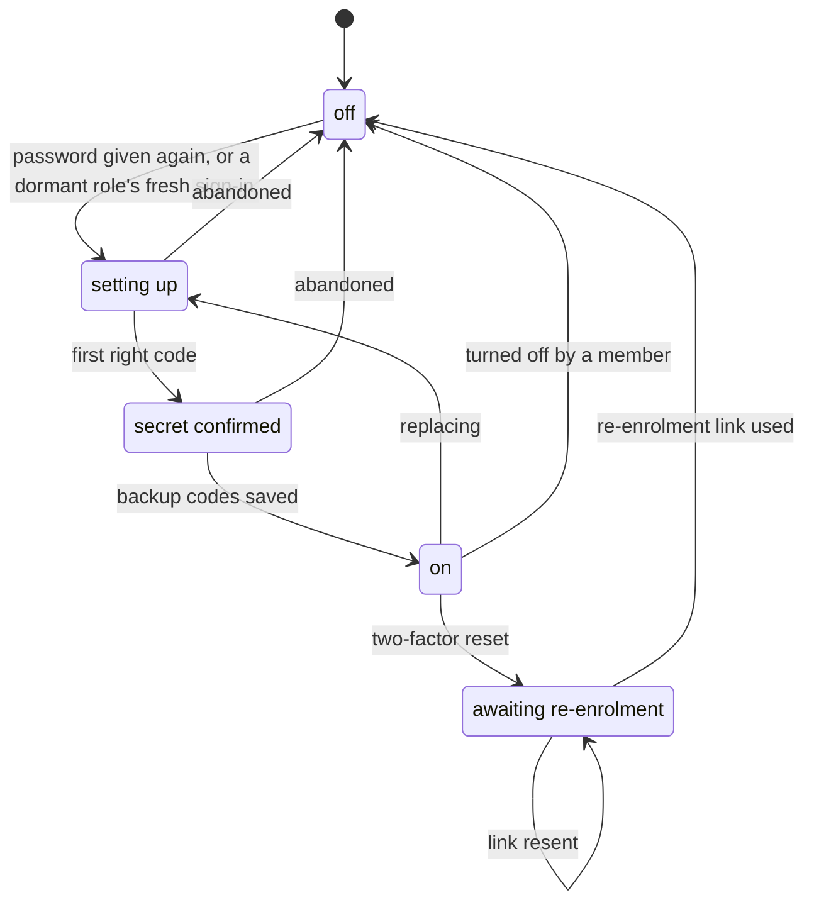
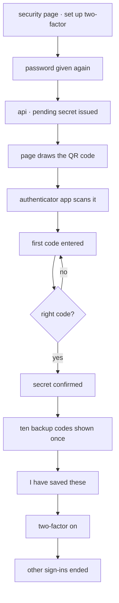
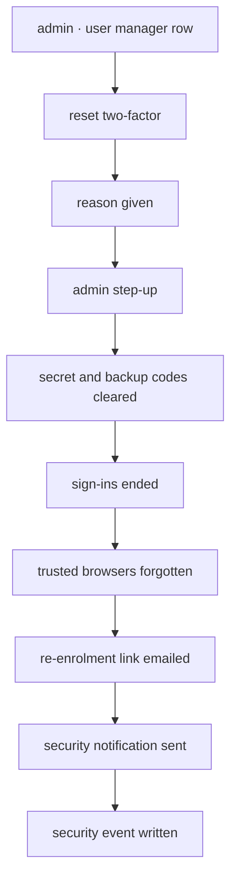

# Two-factor

Two-factor authentication asks for a second proof after the password: a code from an
authenticator app, or a backup code. It is optional for everybody and required for
anybody holding a granted role. This doc covers how somebody gets it, keeps it, changes
it and, having lost it, gets it back.

## 1. Scope

Covers setting up two-factor, the one-time offer after sign-in, forced set-up for a
dormant role, turning it off, replacing it, backup codes, step-up, trusted browsers,
the admin two-factor reset with its re-enrolment link, erasure and the operator
break-glass.

Does not cover:

- **[Signing in](../sign-in/README.md).** Asking for the code at sign-in, the challenge
  and what a trusted browser skips there.
- **[Account lock](../account-lock/README.md).** The security notifications these
  changes send, and the lock link they carry.
- **[Security page](../security-page/README.md).** The page these controls sit on.
- **[Recovery emails](../recovery-emails/README.md).** The board's activation and
  password-reset emails. A re-enrolment link is sent by an admin, from the user
  manager, not from the recovery manager.

## 2. Actors and entry points

| Actor | Entry point |
|-------|-------------|
| Anybody signed in | `/account/security/two-factor` — turn off, replace, backup codes; `/account/security/two-factor/set-up` — set up or replace, password first |
| Somebody without two-factor, once | the offer shown after signing in |
| Somebody holding a dormant role | `/account/set-up-two-factor`, straight after signing in, without the password again |
| Admin | `/user-manager` — reset two-factor, resend the re-enrolment link |
| Somebody whose two-factor was reset | the re-enrolment link in their email |
| Operator with cluster access | the break-glass command in the api image |

## 3. States

| State | Stored as | What it permits |
|-------|-----------|-----------------|
| Off | no active authenticator row | sign-in with the password; a granted role is dormant |
| Setting up | a pending secret, apart from any active one | nothing new; the pending secret signs nobody in |
| Secret confirmed | the pending secret with a right code accepted, and ten pending backup code hashes | nothing new; still signs nobody in |
| On | an active secret, encrypted at rest, plus its last accepted time step; ten backup code hashes; when the person confirmed the codes were saved | sign-in with password and code |
| Awaiting re-enrolment | no secret, no backup codes, a live `TWO_FACTOR_REENROLMENT` row in `recovery_tokens` | nothing with the password alone |

A **dormant role** is not a state of two-factor but of the grant: a granted role held
while two-factor is off. It returns to force the moment two-factor is on.

The offer is answered once per person. The time it was answered is stored on the
person, so a new browser does not ask again and a closed tab does not count as an
answer.

## 4. Invariants

- An active secret **cannot** be overwritten by setting up again. Replacing sets up a
  pending secret beside it, and the active one is swapped out only when the person
  confirms the new backup codes are saved.
- A pending secret **cannot** sign anybody in, even after its first right code.
- Two-factor **cannot** turn on before the person confirms the backup codes are saved.
  That confirmation is stored, so two-factor is never on for somebody who never saw their
  codes.
- Setting up **cannot** start without the password being given again, so a sign-in
  taken over without the password cannot add its own authenticator app. The one exception
  is a sign-in a dormant role opened less than ten minutes ago, and it lets that sign-in
  set up and do nothing else a step-up guards.
- Backup codes **cannot** be shown twice. They are shown once when two-factor turns on
  or when they are regenerated, and only their hashes are kept.
- Regenerating backup codes **cannot** leave any older code usable.
- A backup code **cannot** be used twice.
- Somebody holding a granted role **cannot** turn two-factor off. They can only replace
  it.
- A granted role held without two-factor **cannot** allow anything beyond member powers.
- Turning two-factor off, replacing it or regenerating backup codes **cannot** happen
  without a step-up.
- A step-up **cannot** last longer than ten minutes.
- An admin **cannot** reset their own two-factor.
- A two-factor reset **cannot** leave a sign-in, a trusted browser, a backup code or the
  secret in place.
- After a two-factor reset the password alone **cannot** sign anybody in. The password
  and the re-enrolment link together can.
- An account **cannot** hold two live re-enrolment links. Resending retires the last.
- The secret **cannot** be read from a database dump. It is encrypted with a key held
  outside the database, per [api ADR-031](../../adr/api/ADR-031-two-factor-authentication.md).
- An erased account **cannot** keep a secret, a backup code, a trusted browser or a
  sign-in, and a restored account comes back with two-factor off.

## 5. The journey

### Setting up

1. The person gives their password again.
2. The api issues a pending secret and answers its `otpauth://` URI, with
   `ESA Blueshell` as the issuer and the username as the label. The page draws the QR
   code itself, and shows the key for typing in by hand.
3. The first right code confirms the secret and returns ten backup codes, shaped
   `xxxxx-xxxxx`. Two-factor is not on yet. Codes are six digits on a thirty-second
   step, accepted one step either side of now.
4. The page shows the backup codes once, with copy and download, and asks the person to
   confirm they have saved them.
5. The confirmation is stored and turns two-factor on.
6. Every other sign-in of theirs ends. The one they set up from carries on.
7. A security notification says two-factor was turned on.

### The offer

Somebody without two-factor and without a granted role is offered it once, on a page
shown straight after signing in: set up now, or not now. Either answer is stored and the
page is not shown to them again. The security page keeps the entry for good.

### Forced set-up

Somebody holding a granted role without two-factor is signed in with member powers and
sent to `/account/set-up-two-factor`, a page of its own with no account tabs and Sign out
as the only way off. The router sends every other route back there until two-factor is on;
signing out stays open. The moment it is on, their granted roles are in force and they go
on to the page they asked for.

The password was given a moment ago, so for the ten minutes after that sign-in opened the
api starts a set-up without it, and the page opens at the phone with three steps: scan, a
first code, the backup codes. Coming back after those ten minutes asks for the password
first. The fresh sign-in counts for nothing else: every other change a step-up guards still
asks for one. Members never see this page; it sends them to the
regular set-up, which always asks for the password.

Granting a role to somebody without two-factor ends every sign-in they hold, records that
in their security log as the admin's doing, and the role email tells them to sign in
again. Their next sign-in is the one above.

This is also what happens to every holder of a granted role on the day two-factor is
released, and to a holder whose two-factor has been reset.

The board posts this in Discord and emails it to every holder of a granted role on
release day:

> **Two-factor authentication on the website.** From today, a board, treasurer or admin
> role on esa-blueshell.nl does nothing until you set up two-factor authentication. Next
> time you sign in you are taken straight to the set-up: scan a QR code with an
> authenticator app (Google Authenticator, Microsoft Authenticator, 1Password, Bitwarden
> or similar), type the code it shows and save the ten backup codes somewhere other than
> your phone. It takes about two minutes, and your role works again the moment it is done.
> Members can turn it on too, on the Security page in the account menu. Lost your phone
> and your backup codes? Ask another admin at board@blueshell.utwente.nl or in
> #board-questions.

### Turning off, replacing and backup codes

| Action | Who | Needs | Effect |
|--------|-----|-------|--------|
| Turn off | somebody holding no granted role | a step-up | secret, backup codes and trusted browsers gone |
| Replace | anybody with two-factor | a step-up, then the set-up journey | old secret and backup codes swapped for the new ones when the new codes are confirmed saved |
| Regenerate backup codes | anybody with two-factor | a step-up | ten new codes shown once; the old ones stop working |
| Use a backup code | at sign-in or step-up | — | that code is spent; with three or fewer left the security page and a banner on every other page ask for new ones |

Each sends a security notification.

### Step-up

A step-up asks for a code, or a backup code, inside a sign-in that already has two-factor.
It is asked before turning off, replacing, regenerating backup codes, changing the
password, changing the email address and before an admin resets somebody's two-factor.
A step-up is good for ten minutes on the sign-in it was given in. A trusted browser
never skips it.

### Trusted browsers

At the code step somebody may tick "trust this browser". For thirty days from then, a
sign-in from that browser skips the code; the cookie is rotated every time it is used,
and the thirty days are not extended by use. A trusted browser never skips a step-up or
the OIDC sign-in to Vault or Headlamp.

A password change or reset, turning two-factor off, replacing it, a two-factor reset and
a lock all forget every trusted browser the person has. Trusting a browser sends a
security notification.

### Two-factor reset

1. The person has lost both the phone and the backup codes, and asks an admin. The admin
   checks it is them away from the site.
2. The admin opens the row in the user manager, whose security button shows whether the
   person has two-factor, chooses reset two-factor, gives a reason and then a step-up of
   their own.
3. The api clears the secret and backup codes, ends every sign-in, forgets every trusted
   browser and emails a re-enrolment link valid for twenty-four hours.
4. The row shows the account as awaiting re-enrolment. Resending from the same row shows
   the email first, with an inert link, then retires the last link and issues a new one.
5. The person follows the link and gives their password. That signs them in.
6. Somebody holding a granted role is sent to forced set-up. Anybody else lands on the
   security page, where set-up is offered and may be left off.

### Break-glass

When no admin can act — the only admin has lost their phone and backup codes, or every
admin account is locked — an operator with cluster access runs the break-glass command
in the api image against a named user. It performs the same two-factor reset, or the
same unlock, writes a security event whose actor is the operator and emails every
admin. The runbook lives beside the other operator runbooks.

## 6. Alternative orderings

A reset can land while the person is setting up a replacement. The reset clears the
pending secret with the active one; a code or a saved-codes confirmation from the
abandoned set-up is refused.

A resend can land after the person has already used the link. The account is no longer
awaiting re-enrolment, and the resend is refused rather than sending a link that would
sign them in a second way.

## 7. Credentials

| Credential | Out of band | Held by | TTL | Use | Authorises | Retired by |
|------------|-------------|---------|-----|-----|------------|------------|
| Authenticator secret | shown once as a QR code | the authenticator app; encrypted in the database | none | one accepted code per time step | the code step and a step-up | replacing, turning off, a two-factor reset, erasure |
| Backup code | shown once | the person | none | once | the code step and a step-up | being used, regenerating, turning off, a two-factor reset, erasure |
| Step-up | no | the sign-in record | ten minutes | many | the changes listed under step-up | its time running out, the sign-in ending |
| Trusted browser | no | an http-only cookie; verifier hashed | thirty days from being trusted | once per sign-in, rotated | skipping the code at sign-in | its lifetime, revoking, a password change or reset, a two-factor change or reset, a lock |
| `TWO_FACTOR_REENROLMENT` | yes, emailed | the recipient's inbox | twenty-four hours | once | signing in with the password while awaiting re-enrolment | being used, expiring, a resend |

## 8. Endpoints

| Path | Method | Authorisation | Request | Response |
|------|--------|---------------|---------|----------|
| `/users/me/two-factor/setup` | POST | signed in; without a password, a dormant role on a sign-in opened less than ten minutes ago | password, or nothing | pending secret's `otpauth://` URI |
| `/users/me/two-factor/confirm` | POST | signed in, pending secret | code | ten backup codes; two-factor not yet on |
| `/users/me/two-factor/saved` | POST | signed in, secret confirmed | — | 204; two-factor on |
| `/users/me/two-factor` | DELETE | signed in, step-up, no granted role | — | 204 |
| `/users/me/two-factor/backup-codes` | POST | signed in, step-up | — | ten backup codes |
| `/users/me/two-factor/offer` | POST | signed in | set up now or not now | 204 |
| `/auth/step-up` | POST | signed in | a code or backup code with two-factor on, the password without | 204; 10 wrong codes per 15 min per account |
| `/users/{userId}/two-factor/reset` | POST | admin, step-up, not self | reason | 204 |
| `/users/{userId}/two-factor/reset/resend` | POST | admin, not self | — | 204; 409 when not awaiting re-enrolment |
| `/recovery/two-factor/re-enrol` | POST | permit all | link, username, password | a sign-in |

## 9. Failure and recovery

| Situation | Result |
|-----------|--------|
| Wrong first code while setting up | refused; the pending secret stays, the person tries again |
| Set-up abandoned | the pending secret is dropped the next time set-up starts; two-factor stays as it was |
| Page closed before the backup codes were confirmed saved | two-factor is not on; set-up starts over, with a new secret, the next time |
| Phone lost, backup codes kept | sign in with a backup code, then replace |
| Phone and backup codes lost | an admin two-factor reset |
| Re-enrolment link expired | the admin resends it from the user manager |
| Turning off with a granted role | refused, 403; replacing is offered |
| Step-up expired | asked again |
| Admin resets themselves | refused, 403 |
| No admin can act | the break-glass command |

## 10. Where the code lives

| Concern | Location |
|---------|----------|
| Setting up, replacing, turning off, backup codes and the offer | `services/api/src/main/kotlin/net/blueshell/api/auth/domain/twofactor/TwoFactor.kt` |
| RFC 6238 codes and base32 | `services/api/src/main/kotlin/net/blueshell/api/auth/domain/twofactor/Totp.kt` |
| Secret encryption, key from `TWO_FACTOR_ENCRYPTION_KEY` | `services/api/src/main/kotlin/net/blueshell/api/auth/domain/twofactor/SecretCipher.kt` |
| Trusted browsers | `services/api/src/main/kotlin/net/blueshell/api/auth/domain/twofactor/TrustedBrowsers.kt` |
| Step-up | `services/api/src/main/kotlin/net/blueshell/api/security/StepUp.kt`, proved through `auth/domain/AccountSecurity.kt` |
| Reset, resend and the re-enrolment link | `services/api/src/main/kotlin/net/blueshell/api/auth/domain/AccountSecurity.kt`, token purpose in `shared/enums/TokenPurpose.kt` |
| Break-glass | `services/api/src/main/kotlin/net/blueshell/api/auth/domain/BreakGlass.kt`, run by `platform/config/BreakGlassCommand.kt` — see the [runbook](../../../platform/docs/break-glass.md) |
| Dormant roles | `services/api/src/main/kotlin/net/blueshell/api/user/persistence/User.kt` |
| Endpoints | `services/api/src/main/kotlin/net/blueshell/api/auth/web/AccountSecurityController.kt` |
| Set-up, backup codes and the step-up dialog | `services/frontend/src/domains/auth/components/` |
| The offer, the security page and re-enrolment | `services/frontend/src/pages/login/TwoFactorOffer.vue`, `Security.vue`, `Reenrol.vue` |
| The admin's dialog | `services/frontend/src/domains/auth/components/AccountSecurityDialog.vue` |

## 11. Testing

| Invariant | Covered by |
|-----------|------------|
| Codes, skew, replay, backup-code hashing, secret encryption | api unit tests under `auth/domain/twofactor/`, against RFC 6238's vectors and an injected clock ([testing ADR-008](../../adr/testing/ADR-008-time-is-injected-where-a-rule-reads-it.md)) |
| Two-factor is on only once the codes are saved; turning it on ends the other sign-ins | `TwoFactorIT` |
| Step-up, its ten minutes, and what a granted role may not do | `TwoFactorIT` |
| A dormant role opens nothing at the api, forward-auth or OIDC | `TwoFactorIT`, `ForwardAuthControllerIT`, `AuthorizationEndpointSecurityTest` |
| A reset clears everything and the password alone does not get back in | `TwoFactorResetIT` and `two-factor.feature` |
| Setting up in a browser, the code step, a trusted browser, forced set-up | `TwoFactorSystemTest` and the frontend e2e `two-factor.spec.ts` |

## Related documentation

- [Signing in](../sign-in/README.md)
- [Account lock](../account-lock/README.md)
- [Security page](../security-page/README.md)
- [api ADR-031](../../adr/api/ADR-031-two-factor-authentication.md) — the two-factor model
- [testing ADR-008](../../adr/testing/ADR-008-time-is-injected-where-a-rule-reads-it.md) — time is injected
