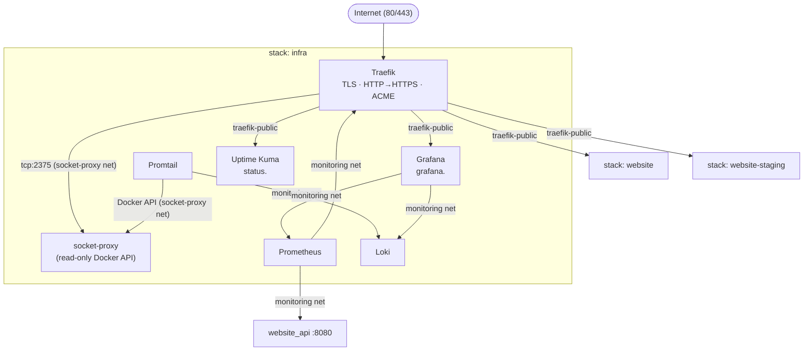

# Infra Stack

The `infra/` directory contains the **shared infrastructure stack** deployed once per server. It runs independently of
any application environment (production, staging, development) and provides:

- **TLS termination** — Traefik handles HTTPS for all application stacks via Let's Encrypt
- **Observability** — Prometheus scrapes metrics; Loki collects logs; Grafana provides dashboards
- **Uptime monitoring** — Uptime Kuma monitors public endpoints
- **Security** — socket-proxy limits Docker API exposure (no raw socket mounted into containers)

---

## Architecture



---

## Services

| Service        | Image                         | Purpose                                                                                |
|----------------|-------------------------------|----------------------------------------------------------------------------------------|
| `socket-proxy` | tecnativa/docker-socket-proxy | Read-only Docker API proxy for Traefik (service discovery) and Promtail (log shipping) |
| `traefik`      | traefik:v3.3                  | Edge proxy: HTTP→HTTPS redirect, ACME TLS certs, routes by Swarm service labels        |
| `prometheus`   | prom/prometheus               | Metrics scraper — Spring Boot actuator + Traefik metrics                               |
| `grafana`      | grafana/grafana               | Dashboards and alerting UI                                                             |
| `loki`         | grafana/loki                  | Log aggregation backend                                                                |
| `promtail`     | grafana/promtail              | Log shipper — reads Docker container logs via socket-proxy                             |
| `uptime-kuma`  | louislam/uptime-kuma          | External uptime monitoring with status page                                            |

---

## First-time Setup

### 1. Create env file

```bash
cp infra/.infra.example.env infra/.infra.env
nano infra/.infra.env   # fill in GRAFANA_ADMIN_PASSWORD at minimum
```

Key variables:

| Variable                      | Required                              | Description                                                                   |
|-------------------------------|---------------------------------------|-------------------------------------------------------------------------------|
| `INFRA_DOMAIN`                | default: `v2.esa-blueshell.nl`        | Base domain — Grafana at `grafana.<domain>`, Uptime Kuma at `status.<domain>` |
| `ACME_EMAIL`                  | default: `board@blueshell.utwente.nl` | Email for Let's Encrypt expiry notices                                        |
| `GRAFANA_ADMIN_PASSWORD`      | **required**                          | Grafana admin account password                                                |
| `TRANSIP_ACCOUNT_NAME`        | **required**                          | TransIP login name (DNS-01 ACME challenge)                                    |
| `TRANSIP_PRIVATE_KEY_FILE`    | **required**                          | Host path to TransIP API private key PEM file                                 |
| `GRAFANA_DISCORD_WEBHOOK_URL` | optional                              | Discord webhook for alert notifications                                       |
| `GRAFANA_SMTP_*`              | optional                              | SMTP settings for email alert notifications                                   |

### 2. Generate a TransIP API key

Traefik uses the TransIP DNS API to complete DNS-01 ACME challenges, which is required for wildcard certificates (
`*.v2.esa-blueshell.nl`).

1. Log in at **[transip.nl/cp/account/api](https://www.transip.nl/cp/account/api/)**
2. Enable the API and create a new key pair
3. Download the private key and save it on the server:

```bash
sudo mkdir -p /etc/traefik
sudo mv ~/transip_key.pem /etc/traefik/transip_key.pem
sudo chmod 600 /etc/traefik/transip_key.pem
```

4. Set in `.infra.env`:

```
TRANSIP_ACCOUNT_NAME=your-transip-login
TRANSIP_PRIVATE_KEY_FILE=/etc/traefik/transip_key.pem
```

### 3. Configure DNS

Before deploying, point these records at the server IP:

| Hostname           | Purpose                 |
|--------------------|-------------------------|
| `grafana.<domain>` | Grafana dashboards      |
| `status.<domain>`  | Uptime Kuma status page |
| `vault.<domain>`   | Infisical secrets vault |

Traefik uses DNS-01 ACME (TransIP) — wildcard certs cover all `*.<domain>` subdomains automatically. DNS records must
exist before deploying so Traefik can resolve them, but the certificate is obtained via the API, not HTTP.

### 5. Deploy

```bash
website infra up
```

---

## Day-to-day Commands

```bash
website infra status              # show all 7 service replicas
website infra logs traefik        # tail Traefik logs
website infra logs grafana        # tail Grafana logs
website infra logs prometheus     # tail Prometheus logs
website infra up                  # deploy or update the stack
website infra down                # remove the stack (certificates are preserved in the letsencrypt volume)
```

---

## Grafana

- **URL**: `https://grafana.<domain>`
- **Default login**: `admin` / value of `GRAFANA_ADMIN_PASSWORD`
- Change the password immediately after first login.

### Adding alert notification channels

1. Open Grafana → **Alerting → Contact points**
2. Add a **Discord** contact point — paste the webhook URL from `GRAFANA_DISCORD_WEBHOOK_URL`
3. (Optional) Add an **Email** contact point — requires `GRAFANA_SMTP_*` to be set

---

## Uptime Kuma

- **URL**: `https://status.<domain>`
- **First boot**: create an admin account on first visit (no default credentials)

Suggested monitors to add after first boot:

| Monitor type | URL / target                          | Friendly name        |
|--------------|---------------------------------------|----------------------|
| HTTP(s)      | `https://esa-blueshell.nl`            | Website (production) |
| HTTP(s)      | `https://staging.esa-blueshell.nl`    | Website (staging)    |
| HTTP(s)      | `https://listmonk.esa-blueshell.nl`   | Listmonk             |
| HTTP(s)      | `http://traefik:8083/ping` (internal) | Traefik ping         |

---

## Prometheus Scrape Targets

Edit `infra/prometheus/prometheus.yml` to manage scrape targets. The file is mounted read-only into Prometheus — after
changes, redeploy with `website infra up`.

To scrape the staging stack, uncomment the `blueshell-api-staging` job in `prometheus.yml`.

---

## Volumes

| Volume                | Purpose                                                           |
|-----------------------|-------------------------------------------------------------------|
| `traefik_letsencrypt` | Let's Encrypt certificates — fixed name, survives stack redeploys |
| `prometheus-data`     | Prometheus time-series data (30-day retention, 2 GB cap)          |
| `grafana-data`        | Grafana dashboards, users, alert rules                            |
| `loki-data`           | Loki log chunks (30-day retention)                                |
| `uptime-kuma-data`    | Uptime Kuma monitor config and history                            |
